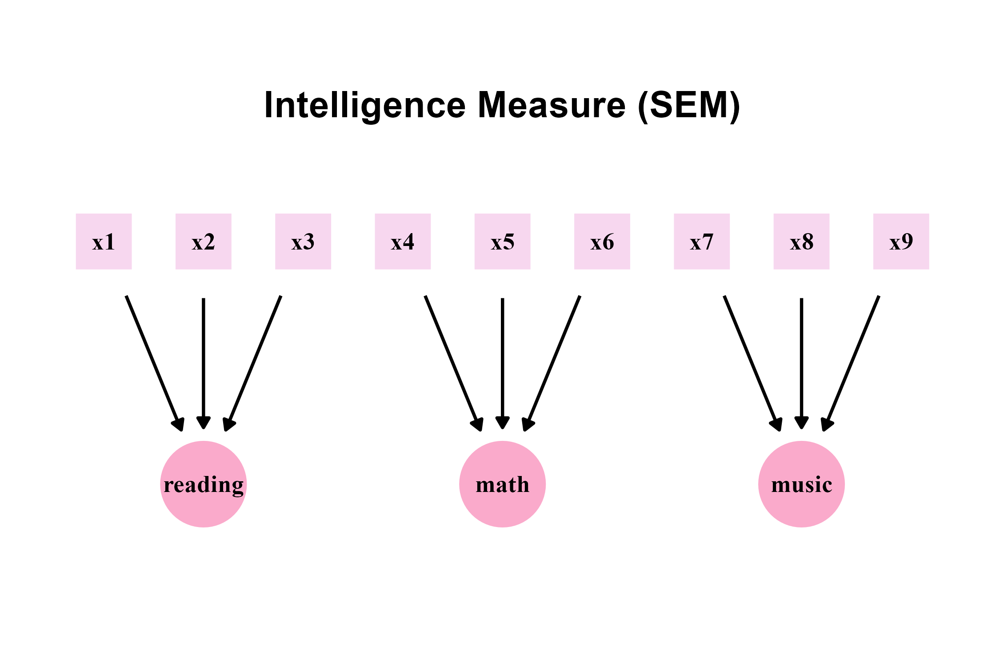

<p align="center">
  <h1><strong>ggsem</strong>: Interactive and Reproducible Visualizations of Networks and Structural Equation Modeling Diagrams</h1>
</p>

Author: Seung Hyun Min

**ggsem** is an R package that allows users to draw path diagrams for structural equation modeling (SEM) and small-to-medium sized networks interactively using the **ggplot2** engine.

As the core of the **ggsem** package, its **shiny** app provides an interface that allows extensive customization, and creates CSV outputs, which can then be used to recreate the figures either using the **shiny** app or in a typical ggplot2 workflow. This will be useful to generate reproducible manuscripts.

Unique features of this R package include options for users to draw gradient lines, gradient arrows, self-loop arrows, as well as interactively change the layout of nodes and edges.
Also, **ggsem** provides layouts of the nodes and edges from the **igraph** package for networks, understands the string input form in *laavan*'s syntax, and supports layouts from the **semPlot** package for SEM diagrams. 

The outputs from the **ggsem** interactive app can be recreated as a raw **ggplot** output in RStudio, allowing users to further modify the graphical output using a **ggplot2** workflow.

[](https://smin95.shinyapps.io/ggsem/)



### Installation using RStudio

The stable version of **ggsem** can be installed using `install.packages()` from the Comprehensive R Archive Network (CRAN).

```r
install.packages("ggsem")
```

The examples on this website use the development version of the package, which can be directly downloaded using the code below:

``` r
install.packages("devtools")
devtools::install_github('smin95/ggsem')
```

### Running the ggsem App 

The **ggsem** app can be initiated online using the link: https://smin95.shinyapps.io/ggsem/. 

It can also be started locally in RStudio (it runs faster):

``` r
ggsem::ggsem()
```

To access an updated tutorial (sample codes and figures) of the package, please visit https://smin95.github.io/ggsem/.


### Disclosure

The creation of the package was in part inspired by this blog post: https://drsimonj.svbtle.com/ggsem-plot-sem-models-with-ggplot2.
