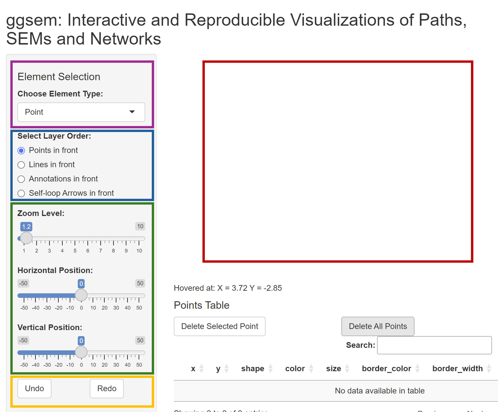
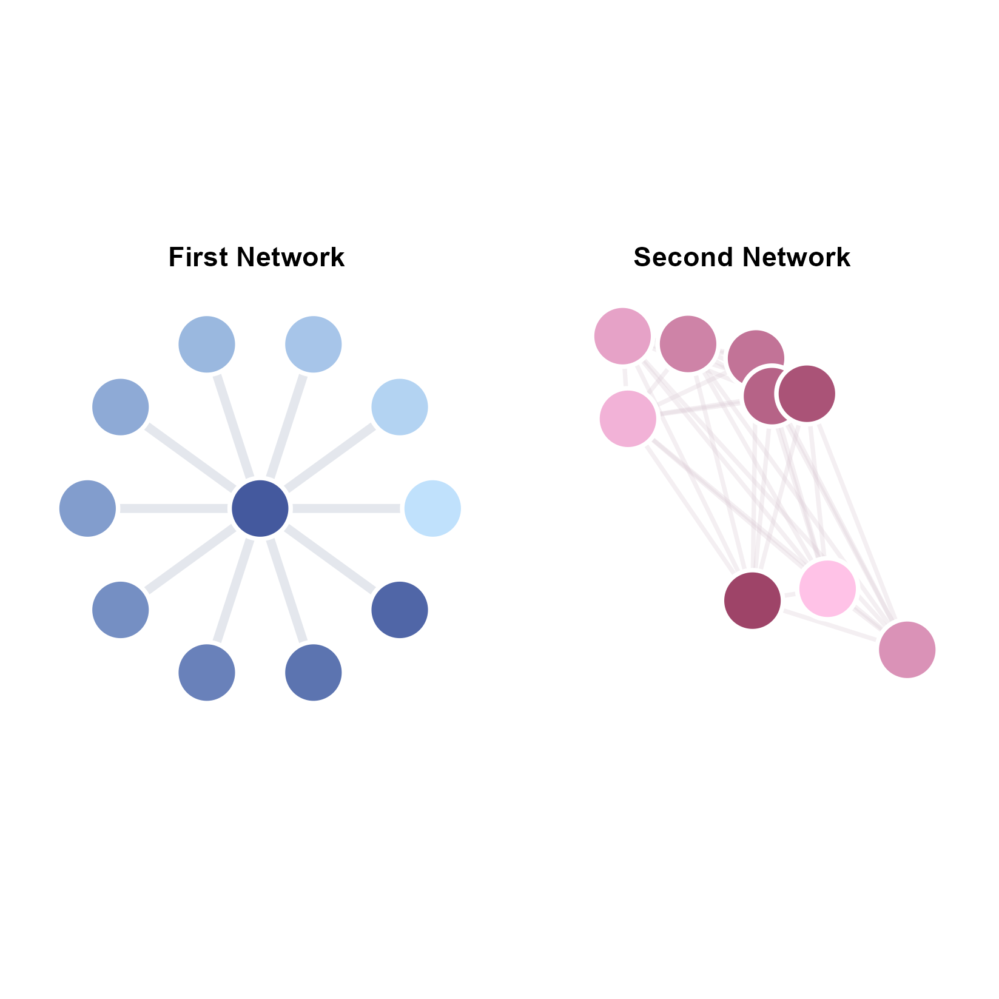
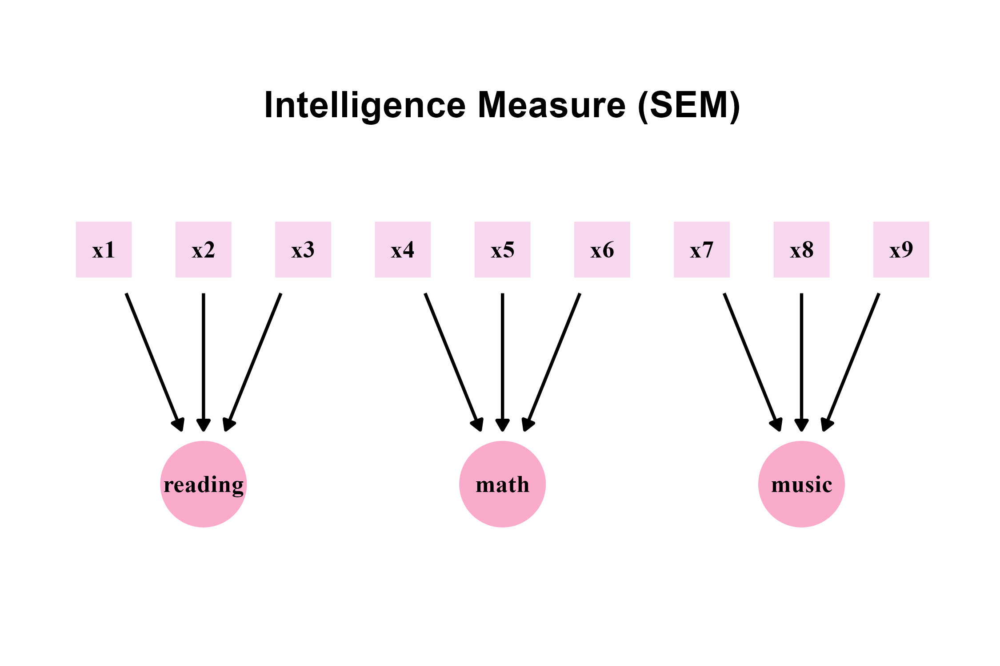

<p align="center">
  <h1><strong>ggsem</strong>: Interactive and Reproducible Visualizations of Networks and Structural Equation Modeling Diagrams</h1>
</p>

Author: Seung Hyun Min

**ggsem** is an R package that allows users to plot path diagrams, structural equation modeling (SEM) diagrams, and small-to-medium sized networks interactively using the **ggplot2** engine.

As the core of the **ggsem** package, its Shiny app provides an interface that allows extensive customization, and creates CSV outputs, which can then be used to recreate the figures either using the Shiny app or in a typical ggplot2 workflow. This will be useful to generate reproducible manuscripts.

Unique features of this R package include options for users to draw gradient lines, gradient arrows, self-loop arrows, as well as interactively change the layout of nodes and edges.
Also, **ggsem** provides layouts of the nodes and edges from the **igraph** package and understands inputs in the form of **lavaan** package's model syntax, which can be used to draw latent factor models on the app in various layouts.

The plot outputs are purely driven by a ggplot2 engine (not plotly), making it possible for users to recreate the plot outputs in RStudio and use plotting functions to further modify the figures in a typical **ggplot2** workflow.

[](https://smin95.shinyapps.io/ggsem_shiny/)



### Installation using RStudio

The development version can be directly downloaded here:

``` r
install.packages("devtools")
devtools::install_github('smin95/ggsem')
```

### Running the Shiny App 

The Shiny app can be initiated online using the link: https://smin95.shinyapps.io/ggsem_shiny/. 

It can also be started locally in RStudio (it runs faster):

``` r
ggsem::launch()
```
 
To access an updated tutorial (sample codes and figures) of the package, please visit https://smin95.github.io/ggsem/.
