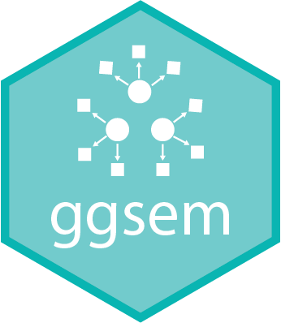

<p align="center">
  
  <h1 align="left" style="font-size: 1.9em;"><strong>ggsem</strong>: An R Package for Interactive and Reproducible Visualizations of Networks and Structural Equation Modeling Diagrams</h1>
</p>


[](https://cran.r-project.org/package=ggsem)
[](https://github.com/smin95/ggsem) [](https://CRAN.R-project.org/package=ggsem) 

**ggsem** is an R package designed for **interactive and reproducible SEM visualization**. It provides a dedicated environment for building, styling, and exploring path diagrams for **structural equation modeling (SEM)** and network analysis.

### Why use ggsem for SEM Visualization?
* **Interactive Parameter Visualization**: Direct manipulation of nodes, edges, and labels without manual coding of coordinates.
* **Multi-Group SEM Support**: Easily create side-by-side or composite visualizations for multi-group SEM diagrams.
* **Workflow Integration**: Seamlessly import model objects from **lavaan**, **blavaan**, **OpenMx**, **tidySEM**, and **semPlot** etc (from 9 classes of objects, 13 packages).
* **Complete Reproducibility**: Export figure metadata to recreate or modify your **ggplot2** diagrams via script at any time.
* **AI-Assisted Modeling**: Built-in support for translating natural language to statistical models or vice versa using LLMs for visualizing path diagrams.

---

### Documentation & Examples

For detailed guides on multi-group workflows and interactive features, visit the official documentation:
👉 **[ggsem Documentation Website](https://smin95.github.io/ggsem/)**

---

### Installation using RStudio

Install the stable version of **ggsem** from CRAN:

```r
# Optional: Install dependencies first
# install.packages(c("colourpicker", "DT", "DiagrammeR", "memoise", "shiny", "shinyjs", "smplot2", "svglite"), dependencies = TRUE)

install.packages("ggsem")
```

To launch the interactive app:

```r
library(ggsem)
ggsem()
```

### Issues and contact

If you find any issues with **ggsem** (both application and package), please contact me via email (seung.min\@mail.mcgill.ca).
