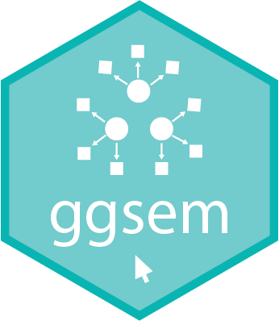

<p align="center">
  
  <h1 align="left" style="font-size: 1.9em;"><strong>ggsem</strong>: An R Package for Interactive and Reproducible Visualizations of Networks and Structural Equation Modeling Diagrams</h1>
</p>


[](https://cran.r-project.org/package=ggsem)
[](https://github.com/smin95/ggsem) [](https://CRAN.R-project.org/package=ggsem) 

Author: Seung Hyun Min


**ggsem** is enables users to perform interactive and reproducible visualizations of path diagrams for structural equation modeling (SEM) and networks using **interactive parameter visualization**. Meta-data of figure outputs from the interactive environment can be either reloaded, replayed or reproduced as objects with figure outputs or images as **ggplot** objects. 

For more information about about **ggsem**, please visit the documentation website (smin95.github.io/ggsem).

### Installation using RStudio

The stable version of **ggsem** can be installed using `install.packages()` from the Comprehensive R Archive Network (CRAN).

```r
# install.packages(c("colourpicker", "DT", "DiagrammeR", "memoise", "shiny", "shinyjs", "smplot2", "svglite"), dependencies = TRUE)
install.packages("ggsem")  # version 0.9.6
```

### Issues and contact

If you find any issues with **ggsem** (both application and package), please contact me via email (seung.min\@mail.mcgill.ca).
