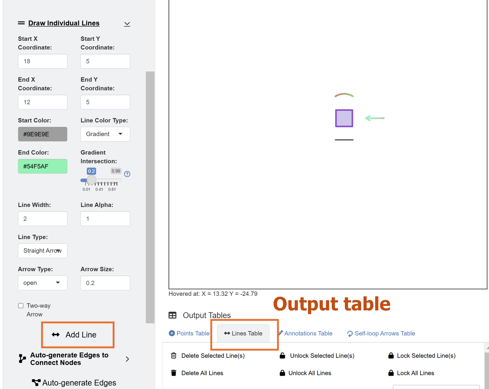
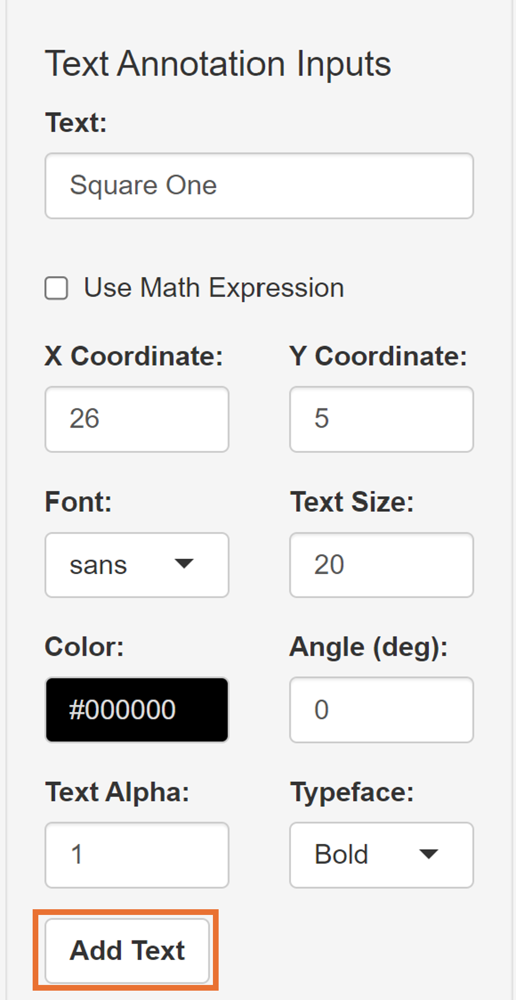
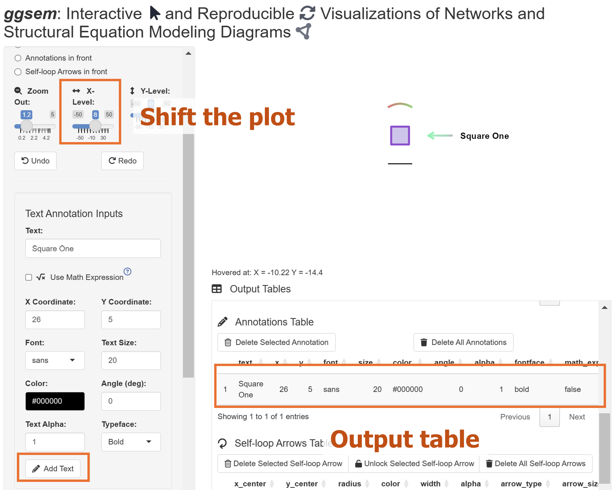
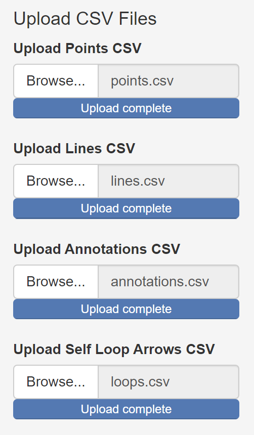
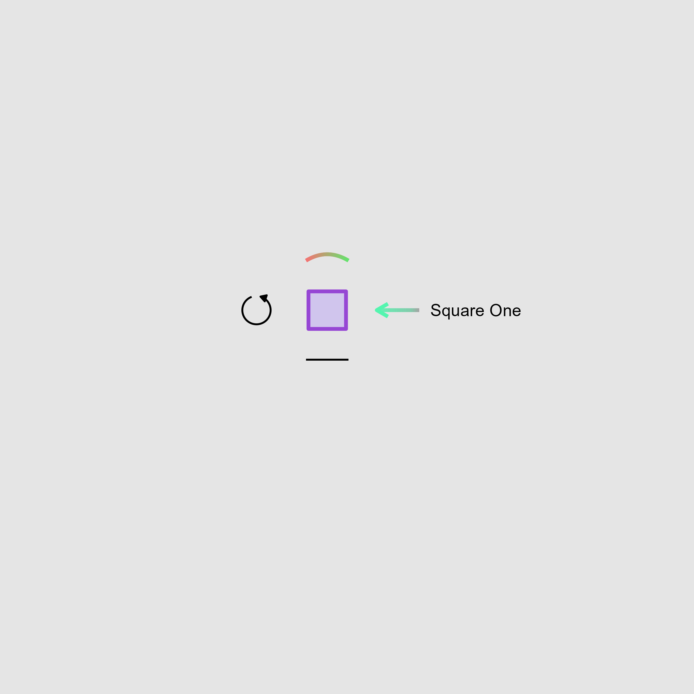

```{r, include = FALSE}
knitr::opts_chunk$set(
  collapse = TRUE,
  comment = "#>"
)
```

## Launching the app 

To begin with, we can launch the `ggsem` Shiny app on the browser using this link: https://smin95.shinyapps.io/ggsem_shiny/.

It can also be started locally in RStudio. First, install the package from my Github repository.

```{r, eval = FALSE}
install.packages("devtools")
devtools::install_github('smin95/ggsem')
```

Then, run the app using the code below:

```{r, eval = FALSE}
ggsem::launch()
```


### The app's layout 

```{r,fig.align = 'left', echo=F, out.width = '90%'}
knitr::include_graphics("layout1.png")
```


The picture shows the `ggsem` app. On the left side, there is a menu. It begins with a dropdown menu for **Element Selection**, allowing users to choose the type of graphical elements to add on the plotting space (inside the purple box). There are five options for **Element Selection**: **Point**, **Line**, **Text Annotation**, **Self-loop Arrow**, and **Lavaan Input**.

Below **Element Selection**, users can select the order of the layer in how the graphical elements are displayed (inside the blue box). The default is set so that points are most at the front. In other words, when a line and a point overlap, a point will mask the line.

Next, there is a slider for **Zoom Level** (within the green box). The default is set to a factor of 1.2x but it can be increased to zoom out (all the way to a factor of 10).

Then, there are sliders for **Horizontal Position** and **Vertical Position** (in the green box). This changes the focus of the plotting space that is displayed. For instance, if a point is cutoff on the right side of the plotting space because the space is not enough, simply adjust the slider for **Horizontal Position**.

Furthermore, there are **Undo** and **Redo** buttons (in the yellow box). These correspond to CTRL + Z and CTRL + Y. respectively. To illustrate, if you have accidently deleted a line, then simply click the **Undo** button to cancel the most previous action. The app remembers all steps of inputs, so **Undo** button can work all the way back to the beginning.

Finally, there's space where plots are rendered (red box). Without further ado, let's add graphical elements and see how these options interact together.

## Adding Elements

### Adding Points 

```{r,fig.align = 'left', echo=F, out.width = '90%'}
knitr::include_graphics("added_point.png")
```

Lets begin by adding a point. The default coordinate of its X and Y position corresponds to the origin (0, 0). After a point is created, users can hover their mouse point on the point and realize that the center of the point is at X = 0 and Y = 0, as shown on the bottomleft of the plotting space.

Users can provide several inputs to specify the aesthetics of the point. This includes not only its X and Y coordinates, but also its filling color (**Point Color**), shape (**Select Shape**), size (**Point Size**), width of the border (**Border Width**), color of the border (**Border Color**), alpha level (**Point Alpha**). 

Here, We can draw a square point by setting the inputs as shown below:

1. **X Coordinate**: 5
2. **Y Coordinate**: 5
3. **Point Color**: #D0C5ED
4. **Select Shape**: *square*
5. **Point Size**: 50
6. **Border Width**: 2
7. **Border Color**: #9646D4
8. **Point Alpha**: 1

After these have been specified, please click the **Add Point** button (pink box) to render the output. If you make any mistakes, you can click the **Undo** button to cancel the changes.

```{r,fig.align = 'left', echo=F, out.width = '35%'}
knitr::include_graphics("add_point.png")
```


### Adding Lines 

```{r,fig.align = 'left', echo=F, out.width = '90%'}

```

Next, we will add a line by selecting *Line* in the dropdown menu of **Choose Element Type**. 

There are numerous parameters of aesthetics that users can specify. We can start by drawing a black line with these coordinates (and leave all other default inputs unchanged):

1. **Start X Coordinate**: 2
2. **Start Y Coordinate**: -2
3. **End X Coordinate**: 8
4. **End Y Coordinate**: -2

After the **Add Line** button has been clicked, a line will be drawn below the purple square (as shown in the picture above). Also, users can delete elements by interacting with the table. Simply click a row of interest, and click the **Delete Selected Point** (in the green box). This line has a single color, as specified in the dropdown menu **Line Color Type**. 


Next, we will draw a curved line, whose curvature is automatically adjusted based on the X and Y coordinates of the line segment but it can be manually adjusted by controlling **Control Point X** and **Control Point Y**. Additionally, we can set it to have a gradient between two colors by setting it as *Gradient*. After we choose *Gradient*, a conditional color menu will appear (**End Color**), as well as **Gradient Intersection**, which is a slider that allows us to give a fine control of where the gradient occurs in the line segment's length.

1. **Start X Coordinate**: 2
2. **Start Y Coordinate**: 12
3. **End X Coordinate**: 8
4. **End Y Coordinate**: 12
5. **Start Color**: #F57373
6. **Line Color Type**: *Gradient*
7. **End Color**: #53F26D
8. **Gradient Intersection**: 0.5
9. **Line Width**: 2
10. **Line Alpha**: 1
11. **Line Type**: *Curved Line*

If gradient intersection is either close to 0 or 1, then it will display one color more than the other. For instance, if its set to 0.01, the *End COlor** will dominate the line segment. 

```{r,fig.align = 'left', echo=F, out.width = '40%'}
knitr::include_graphics("green_red_line.png")
```


Next, we will add an arrow by setting the dropdown menu **Line Type** as *Straight Arrow*, with these parameters below:

1. **Start X Coordinate**: 18
2. **Start Y Coordinate**: 5
3. **End X Coordinate**: 12
4. **End Y Coordinate**: 5
5. **Start Color**: #9E9E9E
6. **Line Color Type**: *Gradient*
7. **End Color**: #54F5AF
8. **Gradient Intersection**: 0.2
9. **Line Width**: 2
10. **Line Alpha**: 1
11. **Line Type**: *Straight Arrow*

```{r,fig.align = 'left', echo=F, out.width = '50%'}

```


Leave the other inputs as intact, such as **Arrow Type** (*open* or *closed* arrowheads) and **Arrow Size** (size of the arrow head).

### Adding Text Annotations 

```{r,fig.align = 'left', echo=F, out.width = '40%'}

```

Now, we will add a text annotation beside the end of the arrow, labelled as "Square One" using these inputs below:

1. **Text**: Square One
2. **X Coordinate**: 26
3. **Y Coordinate**: 5
4. **Font**: *Arial*
5. **Text Size**: 20
6. **Color**: #000000
7. **Angle (deg)**: 0
8. **Text Alpha**: 1
9. **Typeface**: *Bold*

After **Add Text** button is pressed, a text "Square One"" will be rendered. However, we see that the text has been cutoff on the right side because there is not enough plotting space. The X and Y coordinates of the text refer to the position of the text's center.

So, we use the slider **Horizontal Position** to re-adjust the focus of the plotting space:

1. **Horizontal Position**: 8

```{r,fig.align = 'left', echo=F, out.width = '40%'}

```

### Adding Self-loop Arrows

```{r,fig.align = 'left', echo=F, out.width = '40%'}
knitr::include_graphics("add_loop.png")
```

Finally, we can add a circular self-loop arrow on the plotting output using these inputs below:

1. **X Coordinate (Center)**: -5
2. **Y Coordiante (Center)**: 5
3. **Radius**: 2
4. **Line Width**: 1
5. **Line Color**: #000000
6. **Line Alpha**: 1
7. **Arrow Type**: *closed*
8. **Arrow Size**: 0.1
9. **Loop Width**: 1
10. **Loop Height**: 1

This will generate the self-loop arrow on the left side after the **Add Self-loop Arrow** button has been clicked.

### Saving Data and Graphics 

```{r,fig.align = 'left', echo=F, out.width = '40%'}

```

Notice that whenever we add graphical element onto the plotting space, the output table gets updated. There are four tables total: 1) **Points Table**, 2) **Lines Table**, 3) **Annotations Table**, and 4) **Self-loop Arrows Table**. Users can directly manipulate the aesthetics of elements by modifying the numiercal inputs in the table, such as x and Y coordinates and alpha level. They can also save the CSV files, close the **ggsem** app, and the load them again to continue working on the figures later in the future.

To download each of the four tables, go down to the dropdown menu **Choose CSV to Download**, and click the button **Download Selected CSV**, for each of the four tables.

To reload the CSV files back into the app, users can click **Browse** under **Upload CSV Files** to locate their CSV files of their interest.

The output image can also exported as either PNG, JPEG, PDF or SVG. 

```{r,fig.align = 'left', echo=F, out.width = '40%'}

```

```{r,fig.align = 'left', echo=F, out.width = '90%',  fig.cap="This picture is the directly exported PNG output from the shiny app."}
knitr::include_graphics("example_one.png")
```

## Modifying the Plot from **ggsem** app in **ggplot2** Workflow

The plot that we have generated can be recreated as a ggplot2 object in RStudio using the function `csv_to_ggplot()`. 

```{r, message = F, warning = F}
library(tidyverse)
library(cowplot)
library(ggsem)

# CSV files from ggsem app
points_data <- read_csv('https://www.smin95.com/points.csv') 
lines_data <- read_csv('https://www.smin95.com/lines.csv')
annotations_data <- read_csv('https://www.smin95.com/annotations.csv')
loops_data <- read_csv('https://www.smin95.com/loops.csv')

p1 <- csv_to_ggplot(points_data = points_data,
                    lines_data = lines_data,
                    annotations_data = annotations_data,
                    loops_data = loops_data,
                    zoom_level = 1.2, # From the ggsem app
                    horizontal_position = 8, # From the ggsem app
                    vertical_position = 0) # Default verfical position on the app
```

We can save the figure as a PNG file to verify whether it is identical to the one we have drawn on the ggsem Shiny app. Here, we set `width = 9` and `height = 9` as the dimension of the exported image file.

```{r}
ggsave('p1.png', p1, width = 9, height = 9)
```

```{r,fig.align = 'left', echo=F, out.width = '90%'}

```


We can also add a plot light-grey (`grey90`) background to our graphical output using typical ggplot2 functions and change the range of the y-axis.

```{r}
p2 <- p1 + theme(
  plot.background = element_rect(fill = "grey90", color = NA)  # Grey background, no border
)
```

We can then save the figure again using `ggsave()`.

```{r, message=F, warning=F}
ggsave('p2.png', p2, width = 9, height = 9)
```


```{r,fig.align = 'left', echo=F, out.width = '90%'}

```

We can also chip away the extra space by directly dealing with the axis limits of the figure. First, we extract the current range of the y-axis limit of the `p2` object.

```{r}
plot_build <- ggplot_build(p2)
plot_build$layout$panel_params[[1]]$y.range # y-axis range
plot_build$layout$panel_params[[1]]$x.range # x-axis range
```

The y-axis spans from -22 to 22. We can reduce the some space at the top and bottom (y-axis range: -8 to 19). To do so, we will need to use the function `coord_cartesian()`. 

```{r, message = F, warning = F}
p2b <- p2 + coord_cartesian(ylim = c(-8,19))
```

We can also modify the range of the x-axis slightly (-9 to 30).

```{r, message = F, warning = F}
p2c <- p2b + coord_cartesian(xlim = c(-9,30))
```

Then, save the figure using `ggsave()`. 

```{r}
ggsave('p2c.png', p2c, width = 5.5, height = 2.3)
```

We have successfully cropped out the empty space and recreated the figure as it would appear on the Shiny app by only using the ggplot2 workflow. 

The `height` and `width` arguments might need to be tested for a few attempts to find the best ones (takes some practice!). Essentially, `csv_to_ggplot()` returns a ggplot2 object where the ratio has been fixed to 1, allowing the plots to appear exactly the same as those from the Shiny app. However, when the x and y limits must be changed in a **ggplot2** workflow (as in this example), this ratio must be broken (by the function `coord_cartesian()`). This changes the relative spacing of visual elements on the plot. So, the ratio has to be set again by setting the `width` and `height` of the output image file, which in here are `width = 5.5` and `height = 2.3`.

**Tip:** If your plot gets cut-off, either increase `width` or `height` (or both) in `ggsave()`.

```{r,fig.align = 'left', echo=F, out.width = '90%'}
knitr::include_graphics("p2c.png")
```
