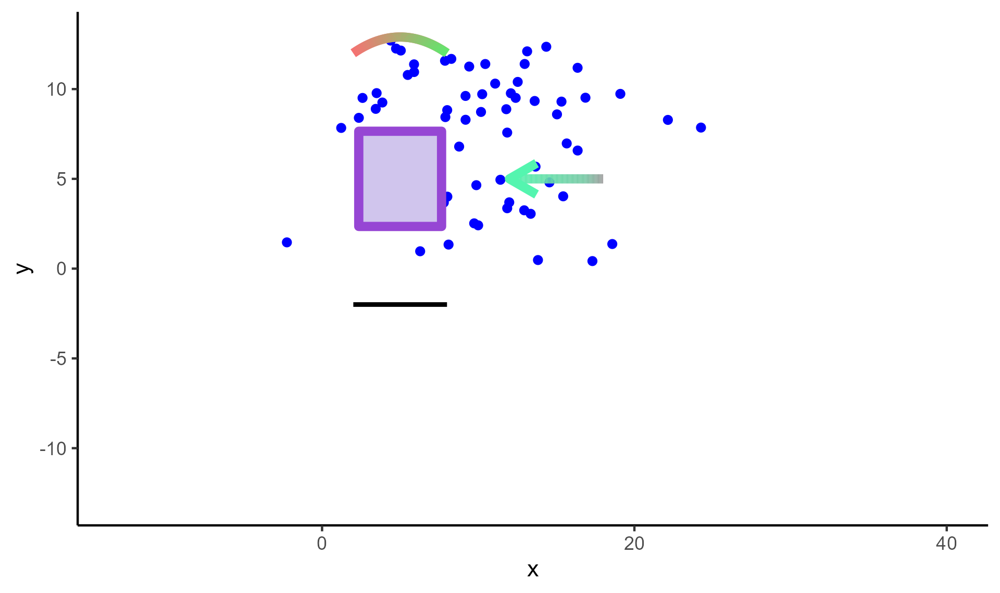
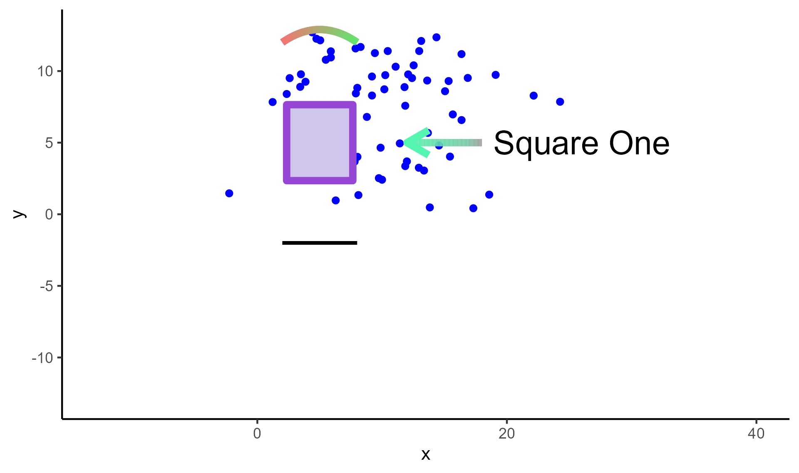

```{r, include = FALSE}
knitr::opts_chunk$set(
  collapse = TRUE,
  comment = "#>"
)
```

In this chapter, we will add annotations using CSV files generated from the **ggsem** app on any  **ggplot** object.

We will use elements that we generated from Chapter 1 (*Drawing Elements*) into our base plot, which is coded below:

```{r, fig.width=6.4, fig.height=3.8, warning = F, message = F, fig.show='hide'}
library(tidyverse)
library(ggsem)

set.seed(2025)

df <- data.frame(
  x = rnorm(100, 10, 5),
  y = rnorm(100, 10, 5)
)

p <- ggplot(df) +
  geom_point(aes(x = x, y = y), color = 'blue') +
  scale_x_continuous(limits = c(-13, 40)) +
  scale_y_continuous(limits = c(-13, 13)) +
  theme_classic()
p
```


```{r, echo = F}
ggsave('ch4_p0.png', p, width = 6.4, height = 3.8)
```

```{r,fig.align = 'left', echo=F, out.width = '85%'}
knitr::include_graphics("ch4_p0.png")
```

## Adding Points

We load the CSV output of points using `read_csv()` function, and paste it on our base plot (`p`) using `draw_points()`. 

```{r, fig.width=6.4, fig.height=3.8, warning = F, message = F, fig.show = 'hide'}
points_data <- read_csv("https://www.smin95.com/points.csv")
p1 <- draw_points(p, points_data)

p1
```

```{r, echo = F}
ggsave('ch4_p1.png', p1, width = 6.4, height = 3.8)
```

```{r,fig.align = 'left', echo=F, out.width = '85%'}
knitr::include_graphics("ch4_p1.png")
```

## Adding Lines

We load the CSV output of lines using `read_csv()` function, and paste it on our base plot (`p1`) using `draw_lines()`. If the CSV output contains information about gradient lines, the resolution of the color gradient can be adjusted with the argument `n` in `draw_lines()`. The default is set to `n = 500` for a fine resolution but it can be quite slow.

```{r, fig.width=6.4, fig.height=3.8, warning = F, message = F, fig.show = 'hide'}
lines_data <- read_csv("https://www.smin95.com/lines.csv")
p2 <- draw_lines(p1, lines_data, n = 100)
p2
```

```{r, echo = F}
ggsave('ch4_p2.png', p2, width = 6.4, height = 3.8)
```

```{r,fig.align = 'left', echo=F, out.width = '85%'}

```

## Adding Text Annotations

We load the CSV output of annotations using `read_csv()` function, and paste it on our base plot (`p2`) using `draw_annotations()`. 

```{r, fig.width=6.4, fig.height=3.8, warning = F, message = F, fig.show = 'hide'}
annotations_data <- read_csv("https://www.smin95.com/annotations.csv")
p3 <- draw_annotations(p2, annotations_data)
p3
```

```{r, echo = F}
ggsave('ch4_p3.png', p3, width = 6.4, height = 3.8)
```

```{r,fig.align = 'left', echo=F, out.width = '85%'}

```

## Adding Self-loop Arrows

We load the CSV output of self-loop arrows using `read_csv()` function, and paste it on our base plot (`p3`) using `draw_loops()`. 

```{r, fig.width=6.4, fig.height=3.8, warning = F, message = F, fig.show='hide'}
loops_data <- read_csv("https://www.smin95.com/loops.csv")
p4 <- draw_loops(p3, loops_data)
p4
```

```{r, echo = F}
ggsave('ch4_p4.png', p4, width = 6.4, height = 3.8)
```

```{r,fig.align = 'left', echo=F, out.width = '85%'}
knitr::include_graphics("ch4_p4.png")
```

## Math Expressions


The **ggsem** app also provides support for adding math expressions. To write math expressions, under the **Text Annotation Inputs** menu, make sure to check the box for **Use Math Expression** (in the orange box), and your **Text** should follow the syntax for math expressions of the function `parse()`. In the **ggsem** app, you can just write strings without the function `parse()`. 

```{r,fig.align = 'left', echo=F, out.width = '50%'}
knitr::include_graphics("math_expression.png")
```

Here are some examples:

```{r, eval = F}
x^2 # superscript
x[2] # subscript
alpha # greek letter
beta # greek letter
x^2 + y[2] == sqrt(alpha * beta) # a formula using above all four 
```

These can also be added directly to any **ggplot** object. In this example, `annotations_data` is a data frame that has the same CSV structure as that from the **ggsem** app, but it contains math expressions:

```{r, fig.width=4.2, fig.height=4.2, warning = F, message = F}
library(ggplot2)
annotations_data <- data.frame(
  text = 'x^2 + y[2] == sqrt(alpha * beta)', x = 26, y = 300, font = 'serif',
  size = 20, color = '#000000', angle = 0, alpha = 1,
  fontface = 'bold', math_expression = TRUE,
  lavaan = FALSE
)

p <- ggplot(mtcars) + geom_point(aes(mpg, disp))

draw_annotations(p, annotations_data)

```
