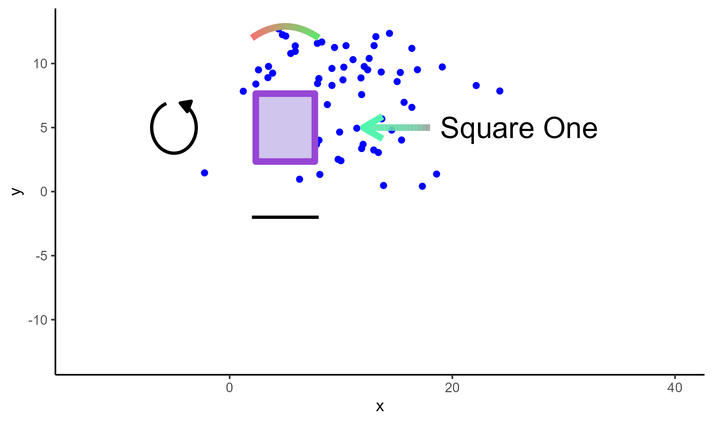

```{r, include = FALSE}
knitr::opts_chunk$set(
  collapse = TRUE,
  comment = "#>"
)
```

In this chapter, we will add annotations using CSV files generated from the **ggsem** app on any  **ggplot** object.

We will use elements that we generated from Chapter 1 (*Drawing Elements*) into our base plot, which is coded below:

```{r, fig.width=6.4, fig.height=3.8, warning = F, message = F}
library(tidyverse)
library(ggsem)

set.seed(2025)

df <- data.frame(
  x = rnorm(100, 10, 5),
  y = rnorm(100, 10, 5)
)

p <- ggplot(df) +
  geom_point(aes(x = x, y = y), color = 'blue') +
  scale_x_continuous(limits = c(-13, 40)) +
  scale_y_continuous(limits = c(-13, 13)) +
  theme_classic()
p
```

## Adding Points

We load the CSV output of points using `read_csv()` function, and paste it on our base plot (`p`) using `draw_points()`. 

```{r, fig.width=6.4, fig.height=3.8, warning = F, message = F}
points_data <- read_csv("https://www.smin95.com/points.csv")
p1 <- draw_points(p, points_data)

p1
```

## Adding Lines

We load the CSV output of lines using `read_csv()` function, and paste it on our base plot (`p1`) using `draw_lines()`. If the CSV output contains information about gradient lines, the resolution of the color gradient can be adjusted with the argument `n` in `draw_lines()`. The default is set to `n = 500` for a fine resolution but it can be quite slow.

```{r, fig.width=6.4, fig.height=3.8, warning = F, message = F}
lines_data <- read_csv("https://www.smin95.com/lines.csv")
p2 <- draw_lines(p1, lines_data, n = 100)
p2
```

## Adding Text Annotations

We load the CSV output of annotations using `read_csv()` function, and paste it on our base plot (`p2`) using `draw_annotations()`. 

```{r, fig.width=6.4, fig.height=3.8, warning = F, message = F}
annotations_data <- read_csv("https://www.smin95.com/annotations.csv")
p3 <- draw_annotations(p2, annotations_data)
p3
```

## Adding Self-loop Arrows

We load the CSV output of self-loop arrows using `read_csv()` function, and paste it on our base plot (`p3`) using `draw_loops()`. 

```{r, fig.width=6.4, fig.height=3.8, warning = F, message = F, fig.show='hide'}
loops_data <- read_csv("https://www.smin95.com/loops.csv")
p4 <- draw_loops(p3, loops_data)
p4
```

```{r, echo = F}
ggsave('ch4_p4.png', p4, width = 6.4, height = 3.8)
```

```{r,fig.align = 'left', echo=F, out.width = '100%'}

```
