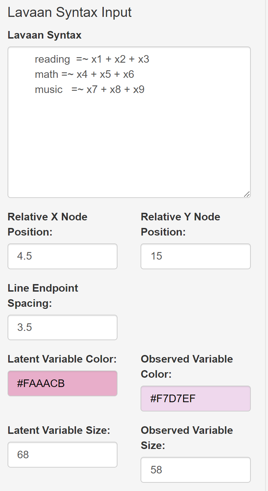
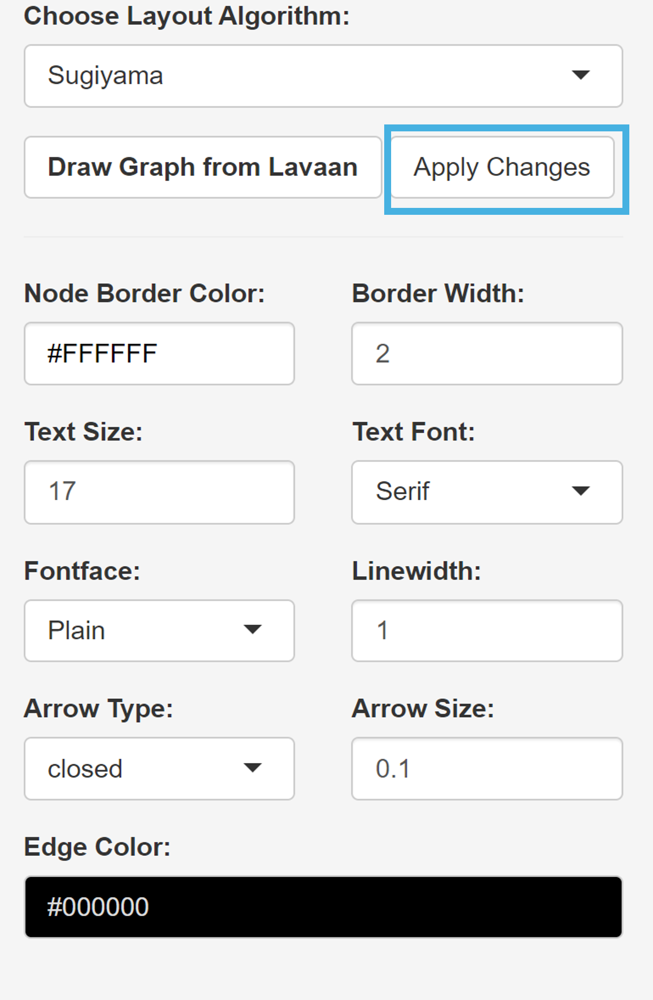
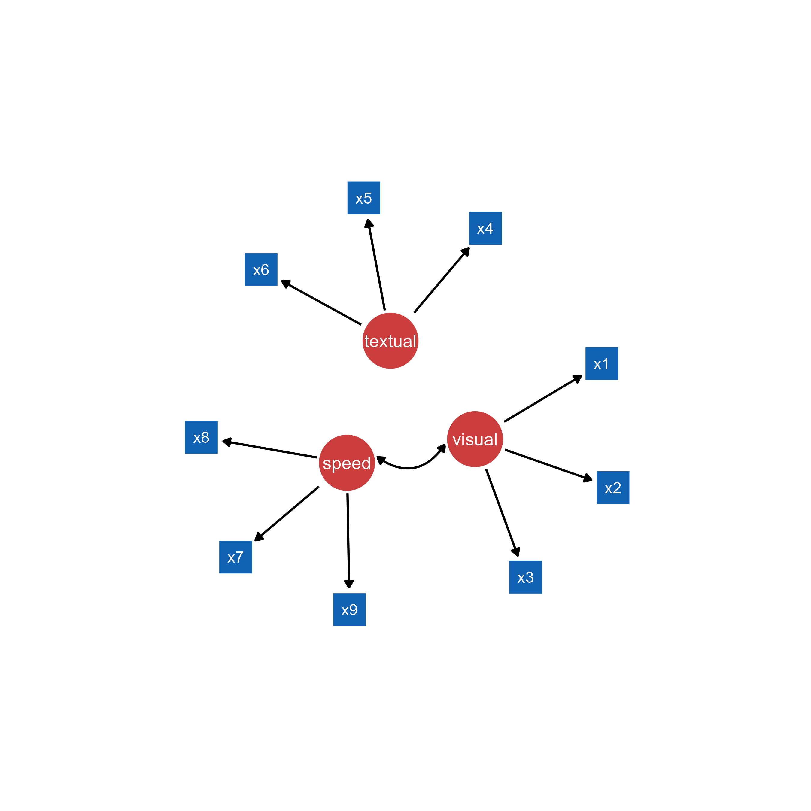
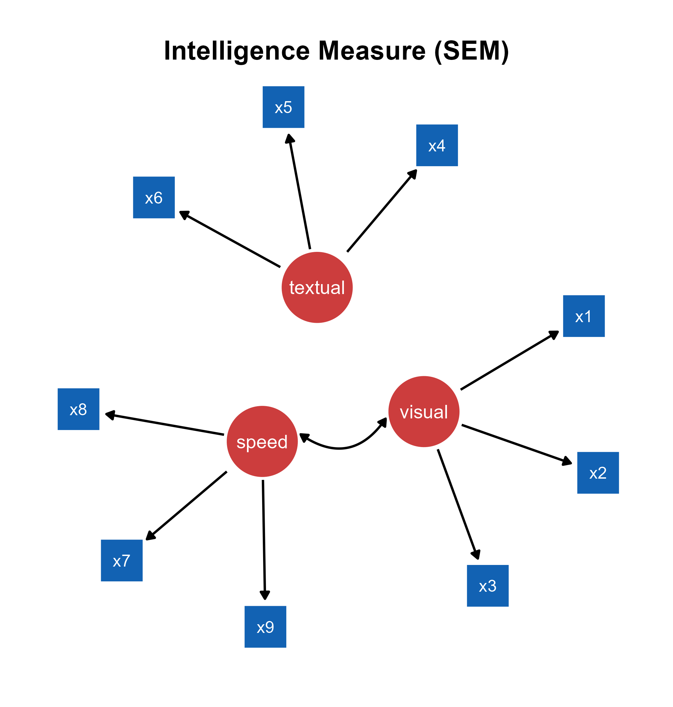
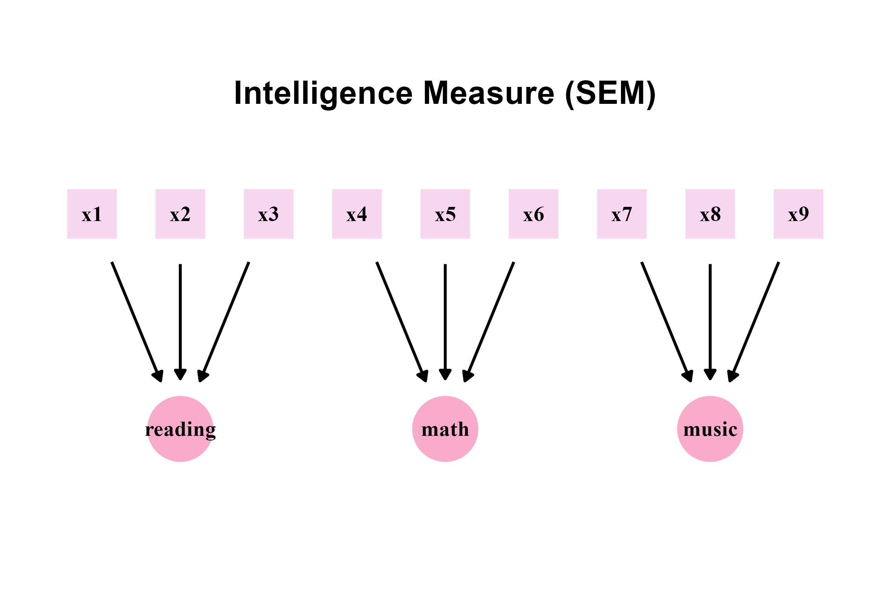

```{r, include = FALSE}
knitr::opts_chunk$set(
  collapse = TRUE,
  comment = "#>"
)
```

In this chapter, we will visualize structural equation modeling (SEM) diagrams. 

## The **lavaan** Package's Syntax

In psychology, the **lavaan** package has been widely used for structural equation modeling (SEM) in R. It integrates methods such as factor analysis, regression models and path analysis into a coherent framework, allowing researchers to study how different variables are related to one another. Basically, models can be specified using strings in a particular syntax of the **lavaan** package. 

```{r, eval = F}
# latent variable definitions
reading <- ~ x1 + x2 + x3
math <- ~ x4 + x5 + x6
music <- ~ x7 + x8 + x9
```

In this example, there are three latent variables (`reading`, `math` and `music`) and nine observed variables (`x1` to `x9`). A latent variable can be inferred from a set of data from other variables but not directly observed. Usually, it captures an index that cannot easily be measured or quantified. 

The string `=~` is a syntax from **lavaan**, often used to define the relationship between latent and observed variables. It can be translated as "is measured by" or "is indicated by". For instance, `music   =~ x7 + x8 + x9` means that the latent variable `music` can be measured with the three variables `x7`, `x8`, `x9`, such as the sense of rhythm, reading ability in music scores, and aptitude in learning to play a musical instrument. In other words, the `=~`operator in **lavaan** denotes a one-way direction. By convention, such as in the **semPlot** package, a one-way arrow drawn from the latent variable to the observed variable

Therefore, to translate the strings above, `reading` can be measured by `x1`, `x2` and `x3` variables (ex. language), `math` can be measured by `x4`, `x5` and `x6` variables, and `music` can be measured by `x7`, `x8` and `x9` variables. 

```{r, eval = F}
stamina ~ running distance
```

Additionally, the `~` operator indicates a causal relationship from the independent variable to the dependent variable. It is also a one-way relationship. For instance, if one's stamina is very high, then one's running distance will be much longer.

Both `~` (regression) and `=~` are shown as a one-way arrow in SEM diagrams, and these are recognized by the **ggsem** app.

'~~' refers to covariance, and **ggsem** plots it as a two-way arrow just like in **semPlot**.

## Drawing **lavaan** input

Let's run the app locally using the code below (faster than online: https://smin95.shinyapps.io/ggsem_shiny/):

```{r, eval = FALSE}
ggsem::launch()
```

```{r,fig.align = 'left', echo=F, out.width = '50%'}

```

We can start by visualizing the SEM diagram using the strings:

```{r, eval = F}
# latent variable definitions
reading <- ~ x1 + x2 + x3
math <- ~ x4 + x5 + x6
music <- ~ x7 + x8 + x9
math ~~ music
```

This string is already written down in the text area of **Lavaan Syntax** under the **Lavaan Input** menu. If readers want to supply their own models, then delete this sample string. Here are some important inputs for drawing a SEM diagram from a lavaan model.

1. **Relative X Node Position**: Relative horizontal spacing between points. The larger the distance, the larger the horizontal gap. 

2. **Relative Y Node Position**: Relative vertical spacing between points. The larger the distance, the larger the vertical gap. 

3. **Line Endpoint Spacing**: Spacing between a node and a edge's endpoint. 

4. **Latent Variable Color**: Color of the nodes that represent latent variables.

5. **Observed Variable Color**: Color of the nodes that represent observed variables.

6. **Latent Variable Size**: The size of the nodes that represent latent variables.

7. **Observed Variable Size**: The size of the nodes that represent observed variables.

8. **Choose Layout Algorithms**: Layout of the nodes and edges. The layouts are from the **igraph** package.

We will adjust these inputs as:

1. **Relative Node X Position**: 4.5

2. **Relative Node Y Position**: 15

3. **Line Endpoint Spacing**: 3.5

4. **Latent Variable Color**: #FAAACB

5. **Observed Variable Color**: #F7D7EF

6. **Latent Variable Size**: 68

7. **Observed Variable Size**: 58

8. **Choose Layout Algorithms**: *Sugiyama*

*Sugiyama* is the most commonly used layout for drawing SEM diagrams. There are additional inputs that need to be set:

9. **Text Size**: 17

10. **Text Font**: *Serif*

11. **Fontface**: *Plain*

12. **Linewidth**: 1.5

13. **Arrow Type**: *closed*

14. **Arrow Size** 0.1

```{r,fig.align = 'left', echo=F, out.width = '50%'}

```


After setting the inputs as specified, we can click the **Draw Graph from Lavaan** button, which creates new graphical outputs. The **Apply Changes** button (in the blue box) modifies the aesthetics of the existing graphical outputs that have been created from the **Lavaan Input** menu. So, if you wish to change the layout (from Sugiyama to Kamada-Kawai) while keeping all other aesthetics unchanged, then you can simply change the layout in the **Choose Layout Algorithms** to *Kamada-Kawai*, and then click the **Apply Changes** button.

It is important to know that **Apply Changes** button modifies the aesthetics of graphical elements that have been created from the **Lavaan Input** menu but not from other menus. For example, if users create self-loop arrows later, these arrows will not be affected by the **Apply Changes** button from the **Lavaan Input** menu because these have not been produced together from the **lavaan** strings. To identify which components have been generated through **lavaan**, check the *lavaan* column in the output tables; if it is set to *TRUE*, then it is part of the *lavaan* output, and it is susceptible to the aesthetic changes brought by the **Apply Changes** button. For self-loop arrows, the *lavaan* column will be set to *FALSE*.  

Readers can also explore with the rest of layout choices to see how layout affects the SEM diagram. Then, they can save the CSV outputs for points, lines and text annotations from the **ggsem** app. Also, if you are not satisfied with the current look of the SEM, you can also change numerical inputs in the table **directly**, such as the X and Y coordinates of the points, lines and texts. 


## Modifying the SEM Diagram from **ggsem** app in **ggplot2** Workflow

```{r, message = F, warning = F}
library(tidyverse)
library(ggsem)

# CSV files from ggsem app
points_data <- read_csv("https://www.smin95.com/sem_points.csv")
lines_data <- read_csv("https://www.smin95.com/sem_lines.csv")
texts_data <- read_csv("https://www.smin95.com/sem_annotations.csv")

sem_plot <- csv_to_ggplot(
  points_data = points_data,
  lines_data = lines_data,
  annotations_data = texts_data,
  element_order = c("lines", "points", "annotations")
) # order priority: lines < points < texts
```


```{r}
ggsave("sem_plot.png", sem_plot, width = 9, height = 9)
```

```{r,fig.align = 'left', echo=F, out.width = '90%'}

```

As in the two previous chapters, we find empty space, which can be removed by reducing the ranges of x- and y-axes. First, we extract the x and y ranges using `get_axis_range()`.

```{r}
get_axis_range(sem_plot)
```

```{r}
sem_plot2 <- sem_plot +
  coord_cartesian(ylim = c(-18, 18), xlim = c(-16, 24))
```

Now, we can add title using the function `annotate()`. It is more convenient because it does not affect the scaling of the figure's components (unlike `ggtitle()`). 

```{r}
sem_plot2b <- sem_plot2 +
  annotate("text",
    label = "Intelligence Measure (SEM)", x = 4, y = 14, size = 7,
    fontface = "bold"
  )
```

```{r}
ggsave("sem_plot2b.png", sem_plot2b, width = 7.5, height = 5)
```

```{r,fig.align = 'left', echo=F, out.width = '90%'}

```

## Hacking the CSV Outputs from **ggsem** app

You can also modify the CSV outputs before converting them into a **ggplot2** object. Notice that font of the texts in the SEM diagram is too faint, so we can *bold* it by directly replacing the values in the `fontface` column of `texts_data`

```{r, message = F, warning = F}
texts_data$fontface <- "bold"
```

Then, we can recreate the figure again using `csv_to_ggplot()`.

```{r}
sem_plot3 <- csv_to_ggplot(
  points_data = points_data,
  lines_data = lines_data,
  annotations_data = texts_data,
  element_order = c("lines", "points", "annotations")
) +
  coord_cartesian(ylim = c(-18, 18), xlim = c(-16, 24)) +
  annotate("text",
    label = "Intelligence Measure (SEM)", x = 4, y = 14, size = 7,
    fontface = "bold"
  )
```

```{r}
ggsave("sem_plot3.png", sem_plot3, width = 7.5, height = 5)
```

```{r,fig.align = 'left', echo=F, out.width = '90%'}

```

The modification of the SEM diagram with **ggplot2** does not have to end here, however. I think the size of the latent variable is a bit too small. I will increase it by modifying the CSV file of 
`points_data`. 

**ggsem** automatically assigns circle to latent variables and square to observed variables, as this is the standard in SEM diagrams. So, we can first identify the latent variables as rows in the data frame with circle points, and then modify their size.

```{r}
which(points_data$shape == "circle") # first three rows are latent variables
```

We save these indices and selectively increase the size of the points to 79.

```{r}
latent_variable_index <- which(points_data$shape == "circle")
points_data[latent_variable_index, ]$size <- 79
```

Then, we can recreate the figure with `csv_to_ggplot()`. 

```{r, warning = F, message = F}
sem_plot4 <- csv_to_ggplot(
  points_data = points_data,
  lines_data = lines_data,
  annotations_data = texts_data,
  element_order = c("lines", "points", "annotations")
) +
  coord_cartesian(ylim = c(-18, 18), xlim = c(-16, 24)) +
  annotate("text",
    label = "Intelligence Measure (SEM)", x = 4, y = 14, size = 7,
    fontface = "bold"
  )
```

```{r}
ggsave("sem_plot4.png", sem_plot4, width = 7.5, height = 5)
```

```{r,fig.align = 'left', echo=F, out.width = '90%'}
knitr::include_graphics("sem_plot4.png")
```

There's more spacing between the observed variables and the arrows than between the latent variables and the arrows. We can also adjust this as well. This time, we will modify the y-coordinates of the observed variables. We select for points that are square, and extract their indices to get their y-coordinates, which are all 5.5 as shown below.

```{r}
observed_variable_index <- which(points_data$shape == "square")
points_data[observed_variable_index, ]$y
```

We can reduce it to 5. Additionally, the `texts_data`'s y-coordinate of the observed variables must also be set to 5 to be matched.

```{r}
points_data[observed_variable_index, ]$y <- 5
texts_data[observed_variable_index, ]$y <- 5
```


Also, in our specific example, the arrows do not end exactly at the same y-coordinate at both ends (`y_end`). This is because some lines are vertically oriented while some others are diagonally oriented. We can fix this too by changing the values of `y_start` and `y_end` columns in `lines_data`.

```{r}
head(lines_data$y_start) # print first six values
head(lines_data$y_end) 

lines_data$y_start <- 2.3  # all values are set to be same
lines_data$y_end <- -6.15
```

Then, we can recreate the figure with `csv_to_ggplot()`. 

```{r, warning = F, message = F}
sem_plot5 <- csv_to_ggplot(
  points_data = points_data,
  lines_data = lines_data,
  annotations_data = texts_data,
  element_order = c("lines", "points", "annotations")
) +
  coord_cartesian(ylim = c(-18, 18), xlim = c(-16, 24)) +
  annotate("text",
    label = "Intelligence Measure (SEM)", x = 4, y = 14, size = 7,
    fontface = "bold"
  )
```

```{r}
ggsave("sem_plot5.png", sem_plot5, width = 7.5, height = 5)
```

```{r,fig.align = 'left', echo=F, out.width = '90%'}
knitr::include_graphics("sem_plot5.png")
```

In summary, the outputs from the **ggsem** app can be directly modified using a **ggplot2** workflow, making each and every graphical element computationally reproducible. I personally prefer to get the general diagram out of the way using the app, and then modify the details using **ggplot2** directly, as I have demonstrated above. But this might differ among different users.
