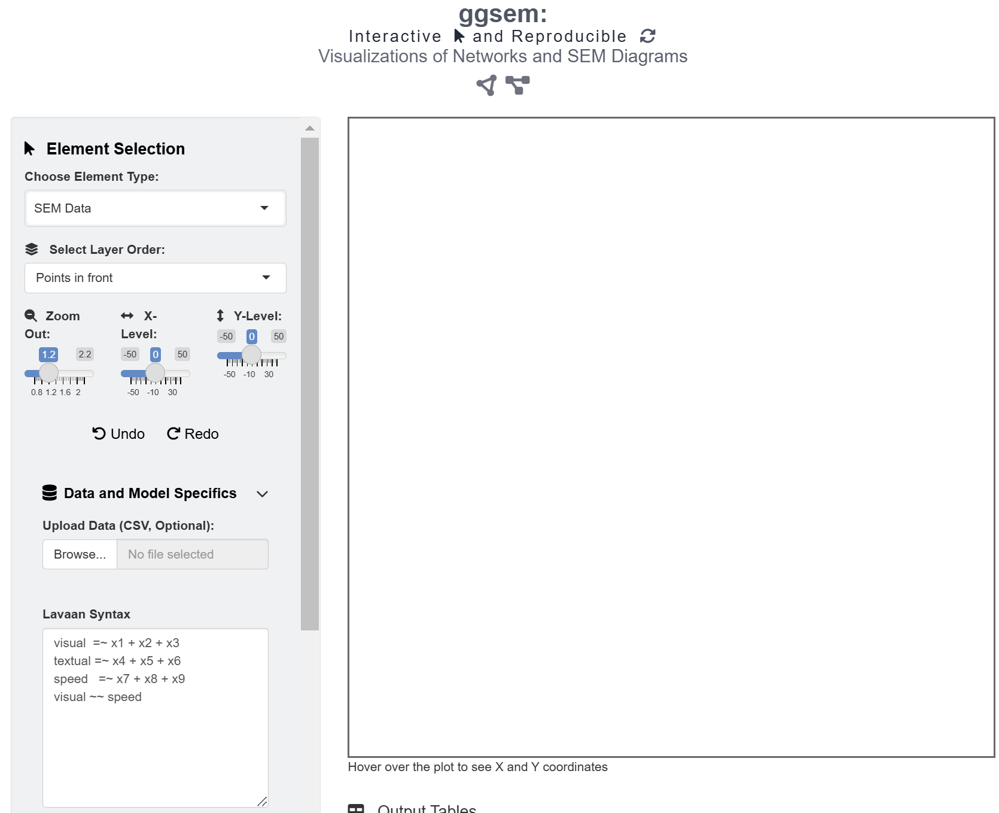
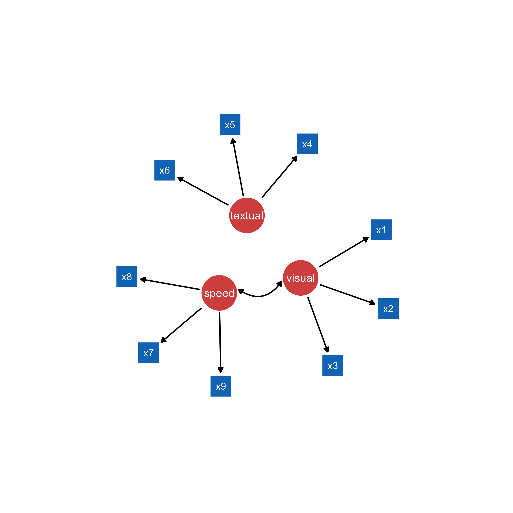
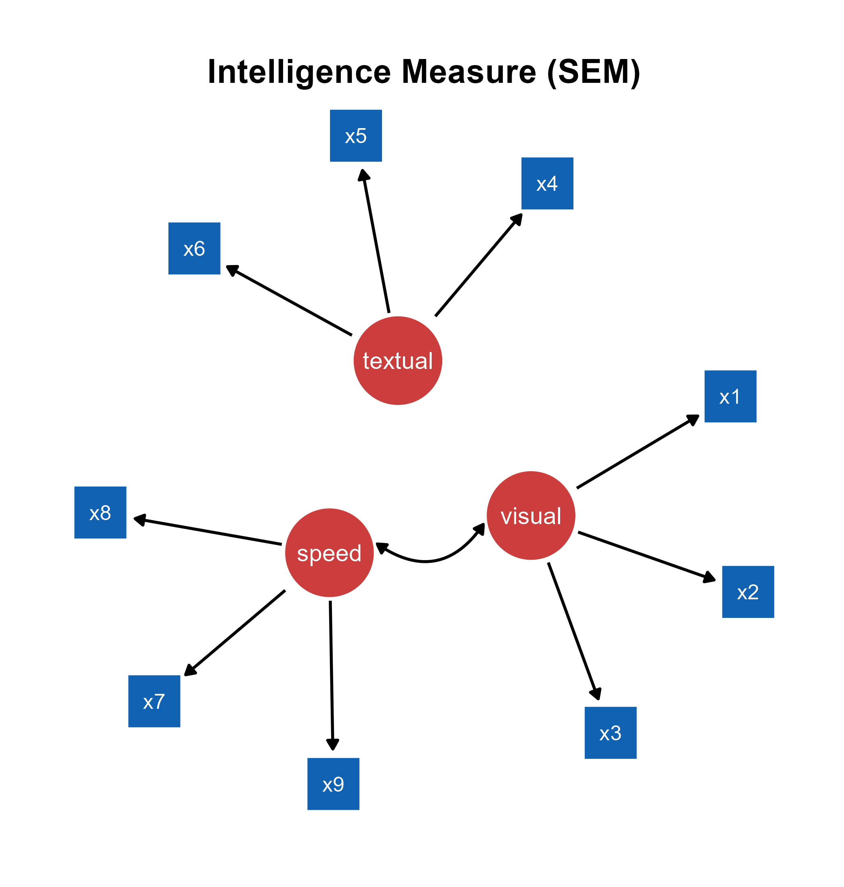
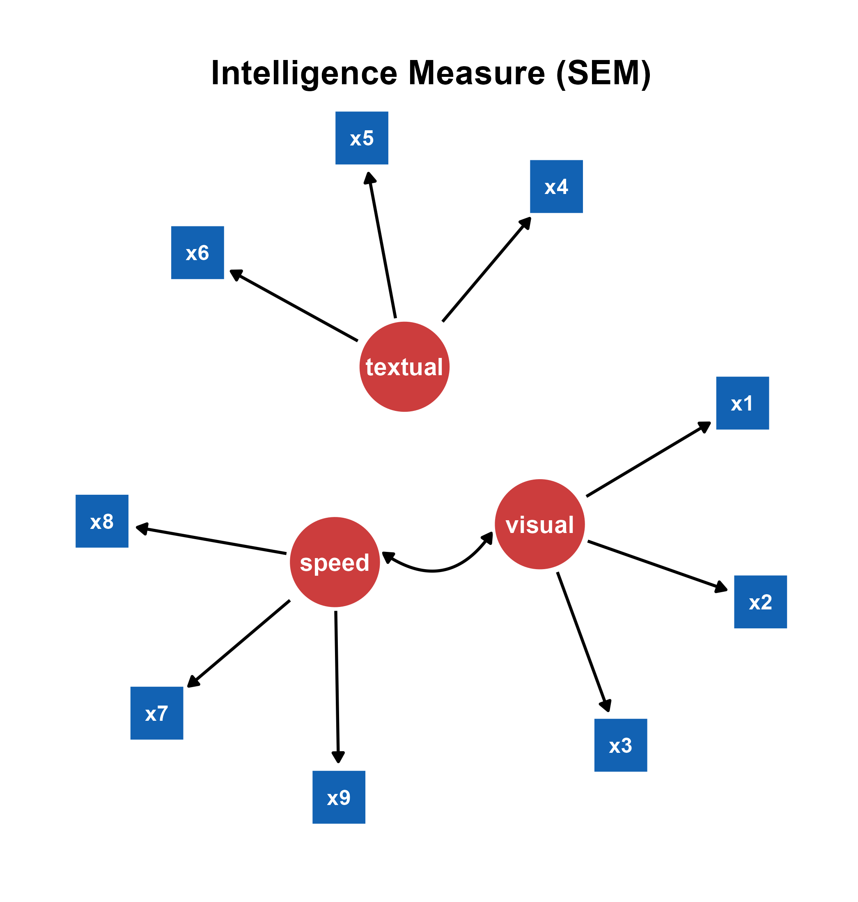

```{r, include = FALSE}
knitr::opts_chunk$set(
  collapse = TRUE,
  comment = "#>"
)
```

In this chapter, we will visualize structural equation modeling (SEM) diagrams. 

## The **lavaan** Package's Syntax

In psychology, the **lavaan** package has been widely used for structural equation modeling (SEM) in R. It integrates methods such as factor analysis, regression models and path analysis into a coherent framework, allowing researchers to study how different variables are related to one another. Basically, models can be specified using strings in a particular syntax of the **lavaan** package in the *ggsem* application.

```{r, eval = F}
# Latent variable definitions
# Copy and paste it into ggsem app without quotations

reading =~ x1 + x2 + x3
math =~ x4 + x5 + x6
music =~ x7 + x8 + x9

music ~~ math
```

```{r,fig.align = 'left', echo=F, out.width = '40%'}

```

In this example, there are three latent variables (`reading`, `math` and `music`) and nine observed variables (`x1` to `x9`). A latent variable can be inferred from a set of data from other variables but not directly observed. Usually, it captures an index that cannot easily be measured or quantified. 

The string `=~` is a syntax from **lavaan**, often used to define the relationship between latent and observed variables. It can be translated as "is measured by" or "is indicated by". For instance, `music   =~ x7 + x8 + x9` means that the latent variable `music` can be measured with the three variables `x7`, `x8`, `x9`, such as the sense of rhythm, reading ability in music scores, and aptitude in learning to play a musical instrument. In other words, the `=~`operator in **lavaan** denotes a one-way direction. By convention, such as in the **semPlot** package, a one-way arrow drawn from the latent variable to the observed variable

Therefore, to translate the strings above, `reading` can be measured by `x1`, `x2` and `x3` variables (ex. language), `math` can be measured by `x4`, `x5` and `x6` variables, and `music` can be measured by `x7`, `x8` and `x9` variables. 

```{r, eval = F}
running distance ~ stamina
```

Additionally, the `~` operator indicates a causal relationship from the independent variable to the dependent variable. It is also a one-way relationship. For instance, if one's stamina is very high, then one's running distance will be much longer.

Both `~` (regression) and `=~` are shown as a one-way arrow in SEM diagrams, and these are recognized by the **ggsem** app in similar fashion as that in **semPlot**.

'~~' refers to covariance, and **ggsem** plots it as a two-way arrow (curved rather than straight) just like in **semPlot** (curved).

## Drawing **lavaan** input

Let's run the app locally using the code below (or online: https://smin95.shinyapps.io/ggsem/):

```{r, eval = FALSE}
ggsem::ggsem()
```

```{r,fig.align = 'left', echo=F, out.width = '100%'}
knitr::include_graphics("sem_fig2.png")
```

We can start by visualizing the SEM diagram using the strings:

```{r, eval = F}
# latent variable definitions
reading =~ x1 + x2 + x3
math =~ x4 + x5 + x6
music =~ x7 + x8 + x9

music ~~ math
```

This string is already written down in the text area of **Lavaan Syntax** under the **SEM Data** menu. If readers want to supply their own models, then delete this sample string. Here are some important inputs for drawing a SEM diagram from a lavaan model.

1. **Center X**: Horizontal center position of the SEM diagram.

2. **Center Y**: Vertical  center position of the SEM diagram.

3. **Width X**: Radius of the SEM's diagram width. If this is set to 15, then the entire width will be 30.

4. **Height Y**: Radius of the SEM's diagram height. If this is set to 15, then the entire height will be 30.

5. **Line Endpoint Spacing**: Spacing between a node and a edge's endpoint. 

6. **Arrowhead Location**: Location of arrowhead (from latent to observed variable or from observed to latent variable).

7. **Latent Variable Color**: Color of the nodes that represent latent variables.

8. **Observed Variable Color**: Color of the nodes that represent observed variables.

9. **Latent Variable Size**: The size of the nodes that represent latent variables.

10. **Observed Variable Size**: The size of the nodes that represent observed variables.

11. **Choose Layout Algorithms**: Layout of the nodes and edges. The layouts are from the **semPlot** package. These include *Tree*, *Circle*, *Spring*, *Tree2*, *Circle2* and *Default*. 

We will adjust these inputs as (and leave the rest unchanged):

1. **Width X**: 20

2. **Height Y**: 20

3. **Line Endpoint Spacing**: 4

4. **Latent Variable Color**: #FAAACB

5. **Observed Variable Color**: #F7D7EF

6. **Latent Variable Size**: 25

7. **Observed Variable Size**: 18

8. **Choose Layout Algorithms**: *Spring*

After specifying the aesthetics, click the **Draw SEM** button (in the blue box), which creates new graphical outputs. 

The **Apply Changes** button (in the pink box) modifies the aesthetics of the existing graphical outputs that have been created from the **SEM Data** menu. 


The **Apply Changes** button modifies the aesthetics of graphical elements that have been created from the **SEM Data** menu but not from other menus. Components generated through **lavaan** have *TRUE* in the *lavaan* column in the output tables. 


The **Lock SEM Changes** button (in the brown box) causes **lavaan** components to have *FALSE* in the *lavaan* column, making them immune to **Apply Changes**. Click it if you are satisfied with the aesthetics.


## Modifying the SEM Diagram from **ggsem** app in **ggplot2** Workflow

```{r, message = F, warning = F}
library(tidyverse)
library(ggsem)

# CSV files from ggsem app
points_data <- read_csv("https://www.smin95.com/sem_points.csv")
lines_data <- read_csv("https://www.smin95.com/sem_lines.csv")
texts_data <- read_csv("https://www.smin95.com/sem_annotations.csv")

sem_plot <- csv_to_ggplot(
  points_data = points_data,
  lines_data = lines_data,
  annotations_data = texts_data,
  element_order = c("lines", "points", "annotations")
) # order priority: lines < points < texts
```


```{r, echo = F}
ggsave("sem_plot.png", sem_plot, width = 9, height = 9)
```

```{r,fig.align = 'left', echo=F, out.width = '90%'}

```

Next, we can remove some empty space by shrinking the range of the axes using `adjust_axis_space()` by 17\% at the top and 20\% at other places (to leave space for a title at the top).

```{r, warning=F, message=F}
sem_plot2 <- adjust_axis_space(sem_plot, x_adjust_left_percent = -20, 
                               x_adjust_right_percent = -20,
                               y_adjust_bottom_percent = -20, 
                               y_adjust_top_percent = -17)
```

Now, we can add title using the function `annotate()`, which does not disrupt the scaling of the figure (`ggtitle()` can be unpredictable). To do so, we first see the limits of the x and y axis ranges to decide where we should annotate.

```{r}
get_axis_range(sem_plot2)
```

```{r, warning=F, message=F}
sem_plot2b <- sem_plot2 +
  annotate("text",
    label = "Intelligence Measure (SEM)", x = 0, y = 30, size = 7,
    fontface = "bold"
  )
```

```{r}
save_figure("sem_plot2b.png", sem_plot2b)
```

```{r,fig.align = 'left', echo=F, out.width = '90%'}

```

## Hacking the CSV Outputs from **ggsem** app

You can also modify the CSV outputs before converting them into a *ggplot* object. Notice that font of the texts in the SEM diagram is too faint, so we can *bold* it by directly replacing the values in the `fontface` column of `texts_data`

```{r, message = F, warning = F}
texts_data$fontface <- "bold"
```

Then, we can recreate the figure again using `csv_to_ggplot()`, then save the output using `save_figure()`.

```{r, warning = F, message = F}
sem_plot3 <- csv_to_ggplot(
  points_data = points_data,
  lines_data = lines_data,
  annotations_data = texts_data,
  element_order = c("lines", "points", "annotations")
) 

sem_plot3b <- adjust_axis_space(sem_plot3, x_adjust_left_percent = -20, 
                               x_adjust_right_percent = -20,
                               y_adjust_bottom_percent = -20, 
                               y_adjust_top_percent = -17)
sem_plot3c <- sem_plot3b +
  annotate("text",
    label = "Intelligence Measure (SEM)", x = 0, y = 30, size = 7,
    fontface = "bold"
  )
```

```{r}
save_figure("sem_plot3c.png", sem_plot3c)
```

```{r,fig.align = 'left', echo=F, out.width = '90%'}

```

In summary, the outputs from the **ggsem** app can be directly modified using a **ggplot2** workflow, making each and every graphical element computationally reproducible. I personally prefer to get the general diagram out of the way using the app, and then modify the details using **ggplot2** directly, as I have demonstrated above. But this might differ among different users.
