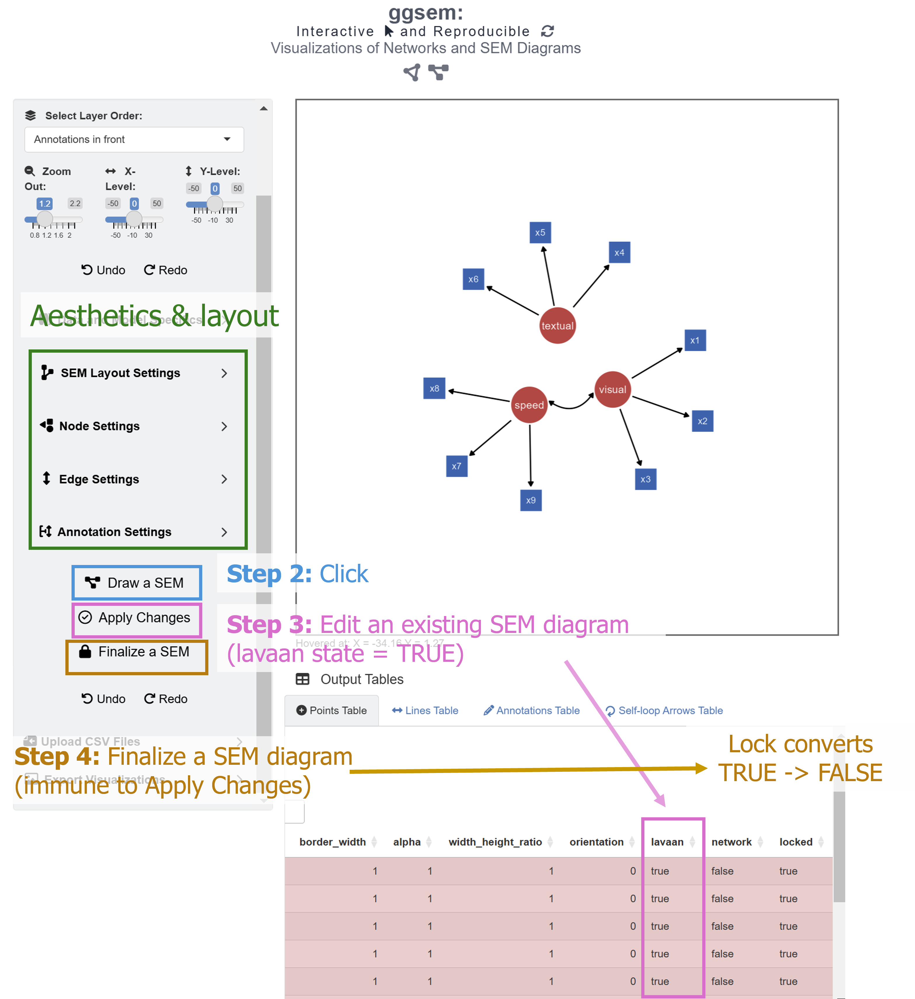
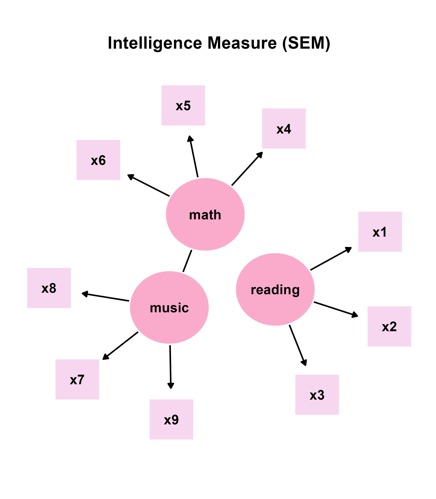

```{r, include = FALSE}
knitr::opts_chunk$set(
  collapse = TRUE,
  comment = "#>"
)
```

In this chapter, we will visualize structural equation modeling (SEM) diagrams. 

## The **lavaan** Package's Syntax

In psychology, the **lavaan** package has been widely used for structural equation modeling (SEM) in R. It integrates methods such as factor analysis, regression models and path analysis into a coherent framework, allowing researchers to study how different variables are related to one another. Basically, models can be specified using strings in a particular syntax of the **lavaan** package. 

```{r, eval = F}
# latent variable definitions
reading =~ x1 + x2 + x3
math =~ x4 + x5 + x6
music =~ x7 + x8 + x9

music ~~ math
```

In this example, there are three latent variables (`reading`, `math` and `music`) and nine observed variables (`x1` to `x9`). A latent variable can be inferred from a set of data from other variables but not directly observed. Usually, it captures an index that cannot easily be measured or quantified. 

The string `=~` is a syntax from **lavaan**, often used to define the relationship between latent and observed variables. It can be translated as "is measured by" or "is indicated by". For instance, `music   =~ x7 + x8 + x9` means that the latent variable `music` can be measured with the three variables `x7`, `x8`, `x9`, such as the sense of rhythm, reading ability in music scores, and aptitude in learning to play a musical instrument. In other words, the `=~`operator in **lavaan** denotes a one-way direction. By convention, such as in the **semPlot** package, a one-way arrow drawn from the latent variable to the observed variable

Therefore, to translate the strings above, `reading` can be measured by `x1`, `x2` and `x3` variables (ex. language), `math` can be measured by `x4`, `x5` and `x6` variables, and `music` can be measured by `x7`, `x8` and `x9` variables. 

```{r, eval = F}
stamina ~ running distance
```

Additionally, the `~` operator indicates a causal relationship from the independent variable to the dependent variable. It is also a one-way relationship. For instance, if one's stamina is very high, then one's running distance will be much longer.

Both `~` (regression) and `=~` are shown as a one-way arrow in SEM diagrams, and these are recognized by the **ggsem** app in similar fashion as that in **semPlot**.

'~~' refers to covariance, and **ggsem** plots it as a two-way arrow (straight rather than curved) just like in **semPlot** (curved).

## Drawing **lavaan** input

Let's run the app locally using the code below (faster than online: https://smin95.shinyapps.io/ggsem/):

```{r, eval = FALSE}
ggsem::launch()
```

```{r,fig.align = 'left', echo=F, out.width = '50%'}

```

We can start by visualizing the SEM diagram using the strings:

```{r, eval = F}
# latent variable definitions
reading =~ x1 + x2 + x3
math =~ x4 + x5 + x6
music =~ x7 + x8 + x9

music ~~ math
```

This string is already written down in the text area of **Lavaan Syntax** under the **Lavaan Input** menu. If readers want to supply their own models, then delete this sample string. Here are some important inputs for drawing a SEM diagram from a lavaan model.

1. **Relative X Node Position**: Relative horizontal spacing between points. The larger the distance, the larger the horizontal gap. 

2. **Relative Y Node Position**: Relative vertical spacing between points. The larger the distance, the larger the vertical gap. 

3. **Line Endpoint Spacing**: Spacing between a node and a edge's endpoint. 

4. **Latent Variable Color**: Color of the nodes that represent latent variables.

5. **Observed Variable Color**: Color of the nodes that represent observed variables.

6. **Latent Variable Size**: The size of the nodes that represent latent variables.

7. **Observed Variable Size**: The size of the nodes that represent observed variables.

8. **Choose Layout Algorithms**: Layout of the nodes and edges. The layouts are from the **semPlot** package. These include *Tree*, *Circle*, *Spring*, *Tree2*, *Circle2* and *Default*. 

We will adjust these inputs as:

1. **Relative Node X Position**: 20

2. **Relative Node Y Position**: 20

3. **Line Endpoint Spacing**: 4

4. **Latent Variable Color**: #FAAACB

5. **Observed Variable Color**: #F7D7EF

6. **Latent Variable Size**: 75

7. **Observed Variable Size**: 58

8. **Choose Layout Algorithms**: *Spring*


There are additional inputs that can be adjusted but these are not changed in this example.

After setting the inputs as specified, we can click the **Draw SEM** button (in the orange box), which creates new graphical outputs. The **Apply Changes** button (in the purple box) modifies the aesthetics of the existing graphical outputs that have been created from the **Lavaan Input** menu. So, if you wish to change the layout (from *Spring* to *Tree*) while keeping all other aesthetics unchanged, then you can simply change the layout in the **Choose Layout Algorithms** to *Tree*, and then click the **Apply Changes** button.

It is important to know that **Apply Changes** button modifies the aesthetics of graphical elements that have been created from the **Lavaan Input** menu but not from other menus. For example, if users create self-loop arrows later, these arrows will not be affected by the **Apply Changes** button from the **Lavaan Input** menu because these have not been produced together from the **lavaan** strings. To identify which components have been generated through **lavaan**, check the *lavaan* column in the output tables; if it is set to *TRUE*, then it is part of the *lavaan* output, and it is susceptible to the aesthetic changes brought by the **Apply Changes** button. For self-loop arrows, the *lavaan* column will be set to *FALSE*.  

Readers can also explore with the rest of layout choices to see how layout affects the SEM diagram. Then, they can save the CSV outputs for points, lines and text annotations from the **ggsem** app. Also, if you are not satisfied with the current look of the SEM, you can also change numerical inputs in the table **directly**, such as the X and Y coordinates of the points, lines and texts. 

**Optional exercise**: Readers can replace the straight two-way arrow with a curved two-way arrow between music and math by removing the straight two-way arrow via the **Lines Table** first, and then adding a curved two-way arrow under **Line Elements**.


## Modifying the SEM Diagram from **ggsem** app in **ggplot2** Workflow

```{r, message = F, warning = F}
library(tidyverse)
library(ggsem)

# CSV files from ggsem app
points_data <- read_csv("https://www.smin95.com/sem_points.csv")
lines_data <- read_csv("https://www.smin95.com/sem_lines.csv")
texts_data <- read_csv("https://www.smin95.com/sem_annotations.csv")

sem_plot <- csv_to_ggplot(
  points_data = points_data,
  lines_data = lines_data,
  annotations_data = texts_data,
  element_order = c("lines", "points", "annotations")
) # order priority: lines < points < texts
```


```{r}
ggsave("sem_plot.png", sem_plot, width = 9, height = 9)
```

```{r,fig.align = 'left', echo=F, out.width = '90%'}
knitr::include_graphics("sem_plot.png")
```

Next, we create some empty space, which can be included by increasing the range of y-axis. First, we extract the x and y ranges using `get_axis_range()` and then modify the y-axis range using `coord_cartesian()`.

```{r}
get_axis_range(sem_plot)
```

```{r, warning=F, message=F}
sem_plot2 <- sem_plot +
  coord_cartesian(ylim = c(-26.4, 30))
```

Now, we can add title using the function `annotate()`. It is more convenient because it does not affect the scaling of the figure's components (unlike `ggtitle()`). 

```{r, warning=F, message=F}
sem_plot2b <- sem_plot2 +
  annotate("text",
    label = "Intelligence Measure (SEM)", x = 0, y = 28, size = 7,
    fontface = "bold"
  )
```

```{r}
ggsave("sem_plot2b.png", sem_plot2b, width = 7, height = 8)
```

```{r,fig.align = 'left', echo=F, out.width = '90%'}
knitr::include_graphics("sem_plot2b.png")
```

## Hacking the CSV Outputs from **ggsem** app

You can also modify the CSV outputs before converting them into a **ggplot2** object. Notice that font of the texts in the SEM diagram is too faint, so we can *bold* it by directly replacing the values in the `fontface` column of `texts_data`

```{r, message = F, warning = F}
texts_data$fontface <- "bold"
```

Then, we can recreate the figure again using `csv_to_ggplot()`.

```{r, warning = F, message = F}
sem_plot3 <- csv_to_ggplot(
  points_data = points_data,
  lines_data = lines_data,
  annotations_data = texts_data,
  element_order = c("lines", "points", "annotations")
) +
  coord_cartesian(ylim = c(-26.4, 30)) +
  annotate("text",
    label = "Intelligence Measure (SEM)", x = 0, y = 28, size = 7,
    fontface = "bold"
  )
```

```{r}
ggsave("sem_plot3.png", sem_plot3, width = 7, height = 8)
```

```{r,fig.align = 'left', echo=F, out.width = '90%'}
knitr::include_graphics("sem_plot3.png")
```

The modification of the SEM diagram with **ggplot2** does not have to end here, however. I think the size of the latent variable is a bit too small. I will increase it by modifying the CSV file of `points_data`. 

**ggsem** automatically assigns circle to latent variables and square to observed variables, as this is the standard in SEM diagrams. So, we can first identify the latent variables as rows in the data frame with circle points, and then modify their size.

```{r}
which(points_data$shape == "circle") # three indices are row numbers for latent variables
```

We save these indices and selectively increase the size of the points to 95.

```{r}
latent_variable_index <- which(points_data$shape == "circle")
points_data[latent_variable_index, ]$size <- 95
```

Then, we can recreate the figure with `csv_to_ggplot()`. 

```{r, warning = F, message = F}
sem_plot4 <- csv_to_ggplot(
  points_data = points_data,
  lines_data = lines_data,
  annotations_data = texts_data,
  element_order = c("lines", "points", "annotations")
) +
  coord_cartesian(ylim = c(-26.4, 30)) +
  annotate("text",
    label = "Intelligence Measure (SEM)", x = 0, y = 28, size = 7,
    fontface = "bold"
  )
```

```{r}
ggsave("sem_plot4.png", sem_plot4, width = 7, height = 8)
```

```{r,fig.align = 'left', echo=F, out.width = '90%'}

```

In summary, the outputs from the **ggsem** app can be directly modified using a **ggplot2** workflow, making each and every graphical element computationally reproducible. I personally prefer to get the general diagram out of the way using the app, and then modify the details using **ggplot2** directly, as I have demonstrated above. But this might differ among different users.
