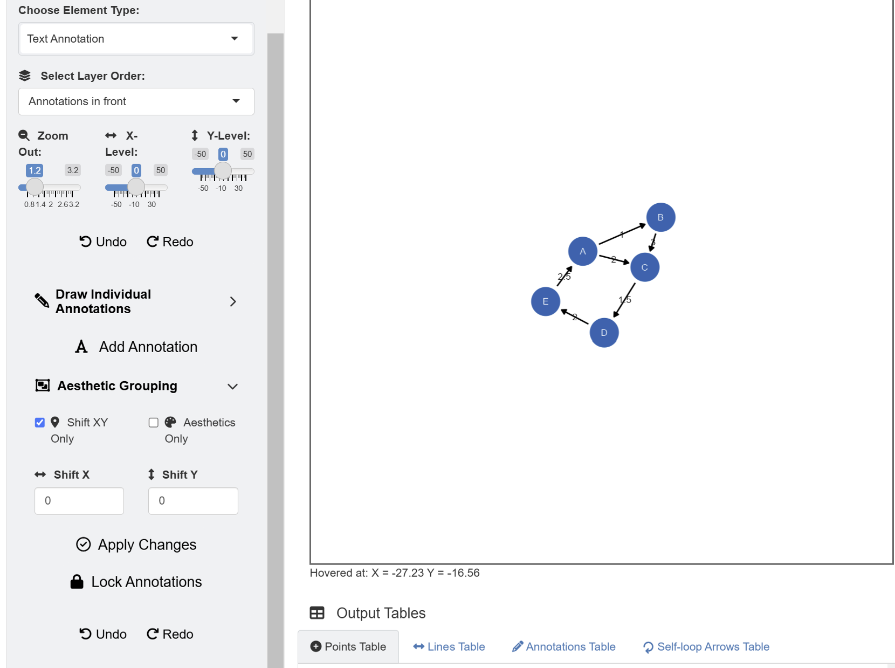
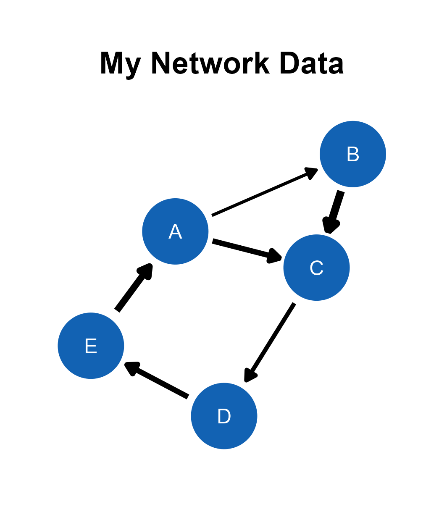

```{r, include = FALSE}
knitr::opts_chunk$set(
  collapse = TRUE,
  comment = "#>"
)
```

In this chapter, we will visualize network diagrams with data files. 

## Data Formats

The *ggsem* web application accepts two types of CSV files for plotting network diagrams: **edge list** and **adjacency matrix**. The examples are shown here.


```{r, message=F, warning=F}
library(tidyverse)
library(ggsem)

edge_list_w <- read.csv('https://www.smin95.com/edges_example.csv') # with edge weight
edge_list_nw <- read.csv('https://www.smin95.com/edges_example_nw.csv') # without weight

edge_list_w # column names
```

The `edge_list_w` data frame stores an edge list with three columns (`source`, `target`, and `weight`). Users should upload CSV files with these column names for their data files to be properly recognized by the *ggsem* web application. `source` contains nodes where edges originate from, and `target` contains nodes where edges arrive. `weight` denotes the strength of the connection. 

The `weight` column can be missing, and the data file can still be recognized by **ggsem**.

```{r, message=F, warning=F}
edge_list_nw
```

Another format of data frame that **ggsem** recognizes is adjacency matrix, as shown below.

```{r, message=F, warning=F}
adj_matrix_symm <- read.csv('https://www.smin95.com/edges_example_adj_symm.csv')
adj_matrix_symm
```

An adjacency matrix is an effective way to record relationships between nodes in network analysis. Rows and columns denote nodes. If the matrix is symmetric (such as `adj_matrix_symm`), then it shows undirected relationships (no direction). Here, there is no weight. 0 represents no connection, while 1 represents a connection.

```{r, message=F, warning=F}
adj_matrix <- as.matrix(read.csv('https://www.smin95.com/edges_example_adj.csv',
                                 row.names = 1, check.names = FALSE))
adj_matrix
```

If the adjacency matrix is asymmetric, then it shows directed relationships, such as `adj_matrix`. It can also contain weight values. If network is weighted, then a value larger or smaller than 1 can be used to denote the strength of the relationship. Here, `adj_matrix` represents a directed graph with weights. 

## ggsem Application

Let's launch the application and visualize the data.

```{r, eval = FALSE}
ggsem()
```

First, readers should download data from https://www.smin95.com/edges_example.csv. Just clicking the link should do the trick. Another way is to load the data in R and save it in your file directory.

```{r, warning=F, message=F}
df <- read_csv('https://www.smin95.com/edges_example.csv')
write_csv(df,'edges_example.csv')
```

```{r,fig.align = 'left', echo=F, out.width = '100%'}
knitr::include_graphics("fig5a.png")
```

After loading the data, users can select *Network Layout Settings* and set the random seed as 3 to reproduce the network diagram that I have created in this example.

```{r,fig.align = 'left', echo=F, out.width = '35%', fig.align='center'}
knitr::include_graphics("fig5b.png")
```

The default color of the nodes is blue and the that of the node label is white. However, these can be changed using input menu in **Node Settings** and **Edge Settings**. 

There are also options to use other types of layouts, such as **Dimensionality Reduction** which employs machine-learning algorithm. The app can also color nodes differently after performing **clustering analysis** using 10 different color palettes from packages such as *RColorBrewer* and *smplot2*.

After setting the random seed and uploading the data onto the *ggsem* app, click the *Draw a Network* button as shown in the figure above.

```{r,fig.align = 'left', echo=F, out.width = '100%'}

```

Since the data frame has a `weight` column, the network diagram has edge labels. These graphical outputs can be accessed in the table below the plotting space for *Annotations*. The rows representing the edge labels have white color rather than red because these are **unlocked**. 

```{r,fig.align = 'left', echo=F, out.width = '100%'}

```

Their unlocked status (from their *locked* column) allows users to group them aesthetically and modify their X and Y positions at once. To do it, go to **Text Annotation** menu. Here, in this example, we will instead delete these elements, and represent the weights visually.

```{r,fig.align = 'left', echo=F, out.width = '80%'}
knitr::include_graphics("fig5d.png")
```

If we go back to the **Network Data** menu's **Edge Settings**, we have the option to scale the width of edges by points. We will set the minimum edge width as 1 and maximum edge width as 2.5. To apply these aesthetic changes to the existing network diagram, click the **Apply Changes** button. 

Remember that **Apply Changes** button changes aesthetics of elements whose **network** column is set to `TRUE`. So, other elements drawn separately (from individual points to SEM diagrams) will not be affected.

```{r,fig.align = 'left', echo=F, out.width = '100%'}

```

Finally, we add text annotation *My Network Data* at X = 0, Y = 17 with text size = 22 and fontface = bold by clicking the **Add Annotation** button in the **Text Annotations** menu.

When saving as a *png* file, users can select the x range and y range of the figure to remove surrounding white space. You can choose to have asymmetric dimensions by unchecking the **Fixed Aspect Ratio** box when saving figures into images. However, in this example, we will remove it in script-based workflow by exporting the outputs as CSV files.

```{r,fig.align = 'left', echo=F, out.width = '40%', fig.align='center'}
knitr::include_graphics("save_viz.png")
```

This is the final output, saved as png image from the *ggsem* application (for demonstration purposes), without removing any white space from the plotting space.

```{r,fig.align = 'left', echo=F, out.width = '100%'}

```

## Modifying the Plot from **ggsem** app in **ggplot2** Workflow

We upload the CSV files and store them in separate objects in R. Then, we use these objects as input to visualize the outputs using `csv_to_ggplot()`.

```{r, warning=F, message=F}
points_data <- read_csv("https://www.smin95.com/points5.csv")
lines_data <- read_csv("https://www.smin95.com/lines5.csv")
annotations_data <- read_csv("https://www.smin95.com/annotations5.csv")

network_plot <- csv_to_ggplot(
  points_data = points_data,
  lines_data = lines_data,
  annotations_data = annotations_data,
  zoom_level = 1.2, # From the ggsem app
  horizontal_position = 0, # From the ggsem app
  vertical_position = 0
)
```

We ensure that `zoom_level`. `horizontal_position` and `vertical_position` match the settings that were used in the **ggsem** app. 

Then, white space can be removed using the `adjust_axis_space()` function, which allows users to asymmetrically remove white space. We remove 30\% of the top space, and 35\% in other areas surrounding the plot because we have already included the plot's title.

```{r, warning = F, message = F}
network_plot_b <- adjust_axis_space(network_plot, x_adjust_left_percent = -35, 
                         x_adjust_right_percent = -35, 
                         y_adjust_top_percent = -30, 
                         y_adjust_bottom_percent = -35)
```

We can save the output `network_plot_b` as an image file using `save_figure()`. No additional argument is needed because this function handles the figure dimensions automatically.

```{r}
save_figure('network_plot_b.png', network_plot_b)
```

```{r,fig.align = 'left', echo=F, out.width = '50%', fig.align='center'}

```
