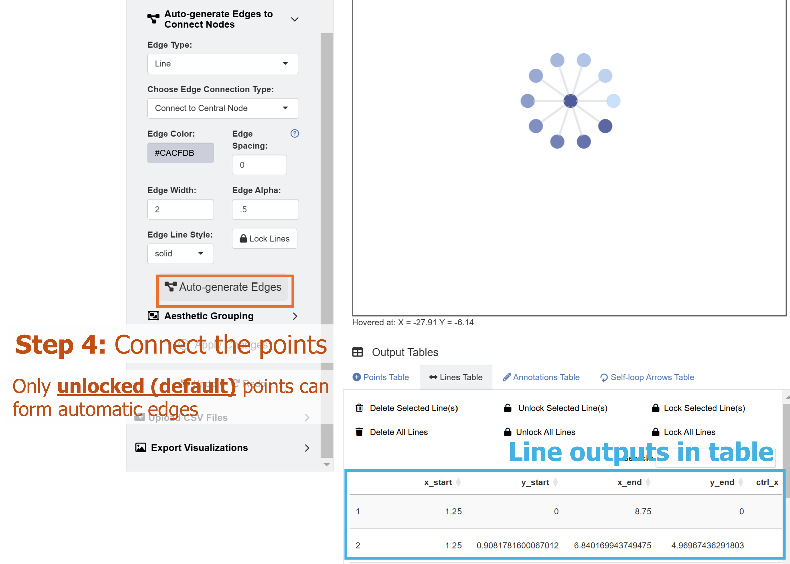
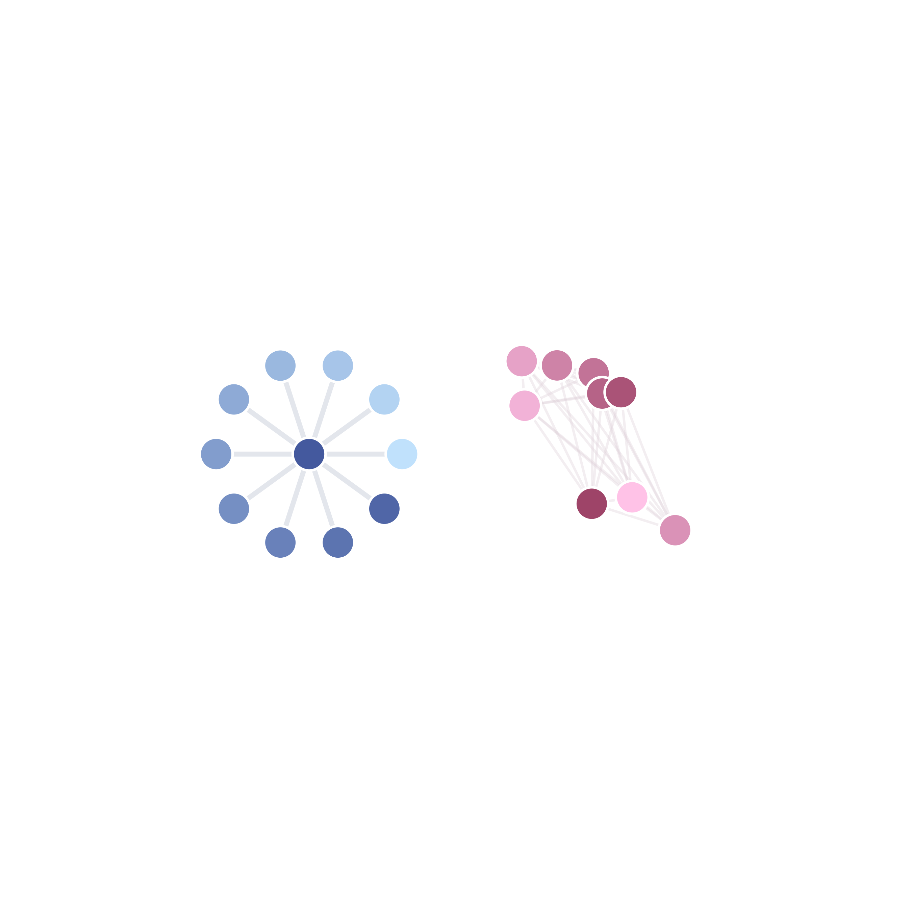
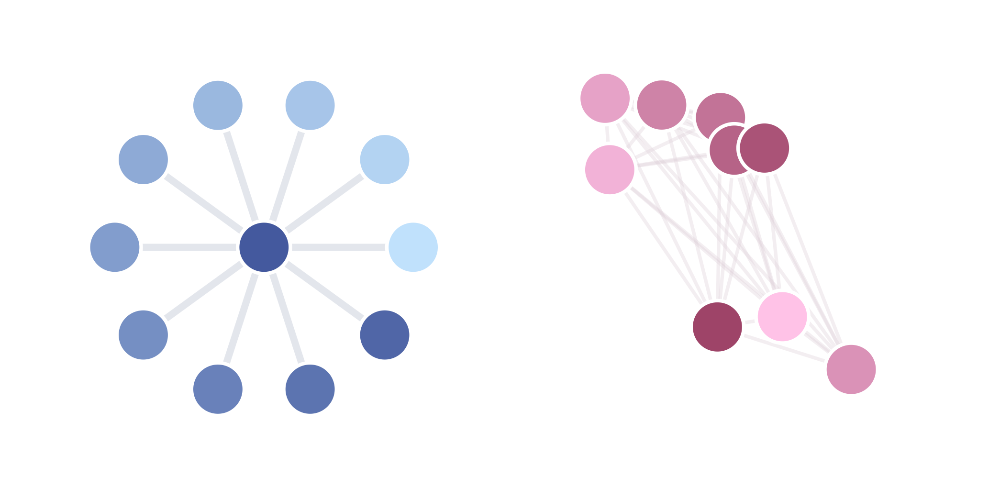

```{r, include = FALSE}
knitr::opts_chunk$set(
  collapse = TRUE,
  comment = "#>"
)
```

The previous chapter discussed how each graphical element could be drawn using the **ggsem** app one-by-one. Here, we discuss about drawing multiple points (nodes) or lines (edges) **at once**. This would allow users to quickly draw a network using the app.

Let's run the app locally using the code below (or online: https://smin95.shinyapps.io/ggsem/):

```{r, eval = FALSE}
ggsem::ggsem()
```

## Network Layouts of Points (Nodes)

```{r,fig.align = 'left', echo=F, out.width = '100%'}
knitr::include_graphics("fig2a.png")
```

The **ggsem** app provides numerous layouts, some of which are derived from the **igraph** package. For instance, if users draw 10 points by clicking the **Add Point** button 10 times, and choose a certain layout, these points can be sorted into a network configuration using the inputs in the **Draw Networks** menu.

Let's start by creating 10 points by clicking the **Add Point** button 10 times (**Point Size** = 10). Since they are all located at the origin (X = 0, Y = 0), they are all overlapped on the same plotting area. So you will only be able to see one black point. To confirm whether there are 10 points, check the **Points Table** and see if there are 10 rows total (blue rectangle in the figure).

```{r,fig.align = 'left', echo=F, out.width = '100%'}
knitr::include_graphics("fig2b.png")
```

In the **Draw Networks** part of the menu, there are some important inputs. These are:

1. **Layout Type**: There are eight provided layouts: 1) *Circle*, 2) *Grid*, 3) *Random*, 4) *Star*, 5) *Fruchterman-Reingold*, 6) *Kamada-Kawai*, and 7) *Straight Line*. 

2. **Point Distance**: Relative distance between two neighboring points/nodes.

3. **Center X Position**: The X coordinate of the network's center.

4. **Center Y Position**: The Y coordinate of the network's center.

5. **Gradient Start Color**: The first color of the gradient.

6. **Gradient End Color**: The second color of the gradient.

There are three additional buttons. These are:

1. **Auto-layout Points**: If you click this button (and if there are at least two *unlocked* points), the points will be arranged into a specific configuration based on the **Layout Type** input.

2. **Apply Gradient**: If you click this button (and if there are at least two *unlocked* points), the filling color of the points will have a gradient palette. 

3. **Lock Points**: If this button is pressed, all existing points in the **Points Table** will become *locked*, becoming immune to the effect of subsequent effects of **Auto-layout Points** and **Apply Gradient**. In other words, if a batch of points has been arranged appropriately, click this button to *keep* its characteristics (position and color). 


Now that we know what these inputs do, let's start by setting the layout of the 10 points as:

1. **Layout Type**: *Circle*

If you click the **Auto-layout Points** button, the points will be sorted into a circle, whose center is at the origin (X = 0, Y = 0) as specified. Since, there is an empty space in the middle, we can add one more point at the center (X = 0, Y = 0) by clicking the **Add Point** button.

Next, we can set the gradient filling color of all points by setting the inputs as:

1. **Gradient Start Color**: #C0E1FC

2. **Gradient End Color**: #44599E

since all 11 points are currently *unlocked* (see *locked* column in **Points Table**), the gradient colors can be applied to them by clicking **Apply Gradient**.

Now, we have a small blue-colored network of eleven points.

```{r,fig.align = 'left', echo=F, out.width = '100%'}

```

## Connecting the Points in a Network

To connect the points in the navy network, we can add lines, so we set (at the top dropdown menu):

1. **Choose Element Type**: *Line*

There are many ways in which the points can be connected with lines (edges) using the **ggsem** app. Let's shift our attention to the dropdown menu of **Choose Edge Connection Type** under **Draw Networks**. There are several options: 

1. *Fully Connected*: Connects edges between each pair of all nodes

2. *Nearest Neighbor*: Links each node to its closest neighbor.

3. *Connect to Central Node*: Links peripheral nodes to a central node (geometric center based on coordinates).

4. *Connect to Particular Node*: Links all nodes to a particular node of choice. When choosing this menu, users should supply the ID number (from the **Points Table**'s first column) of the point in **Select Central Node**.

5. *Random Graph*: Links nodes in a random fashion based on the Erdos-Renyi model. It is different each time.

Here, we will choose *Connect to Central Node*. But as practice, readers can also choose the option *Connect to Particular Node*, find the ID number of the central point in the **Points Table**, and connect all peripheral nodes to the central one.

```{r,fig.align = 'left', echo=F, out.width = '100%'}

```

It turns out the ID of the central node is 11 as it has the coordinate of X = 0 and Y = 0. We can choose the aesthetics of the lines that will automatically generated as:

1. **Edge Color**: #CACFDB

2. **Edge Width**: 2

3. **Edge Alpha**: 0.5

**Edge Spacing** controls the space between nodes and endpoints of edges. 

```{r,fig.align = 'left', echo=F, out.width = '100%'}
knitr::include_graphics("fig2d.png")
```

Next, we will create another network using these layout functions. But before that, we will need to **lock** these points, so that later usages of **Draw Networks* functions will not affect their positions and edge connections.

To do so, we go back to the **Point** menu, and click the **Lock Points** button (orange rectangle) under **Draw Networks**. 


## Drawing a Second Network

```{r,fig.align = 'left', echo=F, out.width = '100%'}

```


For the second network, let's add 11 points by clicking the **Add Point** button 11 times. Make sure you check the **Points Table** and see if there are additional 11 rows (22 rows total). Then, we adjust the focus of the plotting window by setting:

1. **X-Level**: 16


```{r,fig.align = 'left', echo=F, out.width = '100%'}
knitr::include_graphics("fig2e.png")
```

Set the layout of the points as:

1. **Layout Type**: *Fruchterman-Reingold*

2. **Point Distance**: 10

3. **Orientation (Degrees**): 0

4. **Center X Position**: 30

5. **Center Y Position**: 0

6. **Gradient Start Color**: #FFC2E7

7. **Gradient End Color**: #9E4468

Then, click the **Auto-layout Points** and **Apply Gradient** buttons.

```{r,fig.align = 'left', echo=F, out.width = '100%'}
knitr::include_graphics("fig2g.png")
```

Now, we go back to the **Line** menu, and automatically generate lines. We can choose the option *Fully Connected* with these aesthetics:

1. **Edge Color**: #DBCAD3

2. **Edge Width**: 1

3. **Edge Alpha**: 0.3

Then, we lock the points in the **Point** menu by clicking **Lock Points**, which will then stabilize the second network into the plotting space.

We can then save the CSV files for the points and lines, and load them in RStudio using a typical **ggplot2** workflow.


```{r,fig.align = 'left', echo=F, out.width = '80%'}

```

## Modifying the Plot from **ggsem** app in **ggplot2** Workflow

As in the first chapter, we can modify the plot output from the **ggsem** app by usihg **ggplot2** functions directly.

```{r, message = F, warning = F}
library(tidyverse)
library(ggsem)

# CSV files from ggsem app
points_data <- read_csv("https://www.smin95.com/points2.csv")
lines_data <- read_csv("https://www.smin95.com/lines2.csv")

p3 <- csv_to_ggplot(
  points_data = points_data,
  lines_data = lines_data,
  zoom_level = 1.2, # From the ggsem app
  horizontal_position = 16, # From the ggsem app
  vertical_position = 0,
  element_order = c("lines", "points")
) # order priority: lines < points
```

We use `csv_to_ggplot()` to convert the CSV outputs from the *shiny* app into a *ggplot* object. Here, we set the order of elements so that the points are more front than the lines using the argument `element_order`. The `lines` is written first, followed by `points`, so `points` are more recently applied, and hence takes the order priority. We use the same `zoom_level`, `horizontal_position` and `vertical_position` as those in the **ggsem** app.

Notice that we do not have CSV files for text annotations and self-loop arrows. So here, we do not provide them, and the `csv_to_ggplot()` still runs smoothly. So, it is unnecessary to load empty CSV for a class of graphical element if it was not previously added in the app. 

The current output has a lot of empty space, so it needs to be trimmed. We remove 10\% on the left and right hand side, and 28\% on the top and bottom of `p3`. We save the output as `p3b`.

```{r, echo = FALSE}
ggsave("p3.png", p3, width = 9, height = 9)
```

```{r,fig.align = 'left', echo=F, out.width = '90%'}

```

```{r, warning = F, message = F}
p3b <- adjust_axis_space(p3, x_adjust_left_percent = -20, 
                         x_adjust_right_percent = -20, 
                         y_adjust_top_percent = -35, 
                         y_adjust_bottom_percent = -35)
```

```{r, echo = FALSE}
save_figure("p3b.png", p3b)
```

```{r,fig.align = 'left', echo=F, out.width = '90%'}

```

Next, we will add text annotations to our graphical output using typical ggplot2 functions, such as `annotate()`. To do so, we extract the plot's ranges of x-axis and y-axis using `get_axis_range()`.

```{r}
get_axis_range(p3b)
```

Now that we know the ranges, we can decide where to exactly add the text annotations. We will add texts on top of each network.

```{r, fig.width=9, fig.height=9}
p4 <- p3b + annotate("text",
  label = "First Network", x = 0.5, y = 14.5,
  fontface = "bold", size = 7
) +
  annotate("text",
    label = "Second Network", x = 29.5, y = 14.5,
    fontface = "bold", size = 7
  )
```

We can then save the figure using `save_figure()`. The empty space is removed, and the figure is in scale automatically. 

```{r}
save_figure("p4.png", p4)
```

```{r,fig.align = 'left', echo=F, out.width = '90%'}
knitr::include_graphics("p4.png")
```


## Hacking the CSV Outputs from **ggsem** app

You can also hack the CSV output values. Here, I will separately plot each network and then combine them using the **patchwork** package. 

I will split `points_data` and `lines_data` data frames. We know that the first network has eleven points and ten lines, so we include them in `points_data1` and `lines_data2`, and include the rest in `points_data2` and `lines_data2`.

```{r}
library(patchwork) # install.packages('patchwork')

points_data1 <- points_data[1:11, ] # First network's point
points_data2 <- points_data[12:nrow(points_data), ]

lines_data1 <- lines_data[1:10, ] # First network's lines
lines_data2 <- lines_data[11:nrow(lines_data), ]
```

Next, we separately convert the CSV outputs into two networks, and shift the `horizontal_position`, placing the network in the plotting space's center. 

```{r, message = F, warning = F}
net1 <- csv_to_ggplot(
  points_data = points_data1,
  lines_data = lines_data1,
  zoom_level = 1.2, 
  horizontal_position = 0, # 0 because blue network's center is at X = 0, Y = 0
  vertical_position = 0,
  element_order = c("lines", "points")
)


net2 <- csv_to_ggplot(
  points_data = points_data2,
  lines_data = lines_data2,
  zoom_level = 1.2,
  horizontal_position = 30, # 30 because red network's center is at X = 30, Y = 0
  vertical_position = 0,
  element_order = c("lines", "points")
)
```

Then we reduce the surrounding empty space of `net1` and `net2` by 25\% by using `adjust_axis_space()` function. We save the outputs as `net1a` and `net2a`. 


```{r, warning = F, message = F}
net1a <- adjust_axis_space(net1, x_adjust_left_percent = -37, 
                         x_adjust_right_percent = -37, 
                         y_adjust_top_percent = -37, 
                         y_adjust_bottom_percent = -37)

net2a <- adjust_axis_space(net2, x_adjust_left_percent = -37, 
                         x_adjust_right_percent = -37, 
                         y_adjust_top_percent = -37, 
                         y_adjust_bottom_percent = -37)
```


Then, we can add title using `ggtitle()` to each of the plots.

```{r, message = F, warning = F}
net1b <- net1a + ggtitle("First Network") +
  theme(plot.title = element_text(hjust = 0.5)) + # Title is aligned to the center
  theme(plot.title = element_text(size = 11, face = "bold")) # Font size of the title


net2b <- net2a + ggtitle("Second Network") +
  theme(plot.title = element_text(hjust = 0.5)) +
  theme(plot.title = element_text(size = 11, face = "bold"))
```

Next, using the `+` operator from **patchwork**, we combine `net1` and `net2` into one **ggplot2** object.

```{r, fig.show='hide'}
net_tgd <- net1b + net2b # One row, two columns
```

We can now save `net_tgd` into an image file using the `save_figure()` function. Here, `scale_factor()` was adjusted slightly to reproduce the figures faithfully. The default value of `scale_factor()` in `save_figure()` is 0.11. 

```{r}
save_figure("net_tgd.png", net_tgd, scale_factor = 0.2)
```

```{r,fig.align = 'left', echo=F, out.width = '85%'}
knitr::include_graphics("net_tgd.png")
```

## Labelling the Nodes with **ggplot2** workflow

I will now discuss how we can label nodes using a **ggplot2** workflow. Here, we will label `net1`. 

First, we remove its empty space by 25\% around the blue network. 

```{r}
net1a <- adjust_axis_space(net1, x_adjust_left_percent = -37, 
                         x_adjust_right_percent = -37, 
                         y_adjust_top_percent = -37, 
                         y_adjust_bottom_percent = -37)
```

We start by creating a data frame of text labels and their X and Y coordinates.

```{r}
texts_data <- data.frame(
  x = points_data1$x,
  y = points_data1$y,
  label = paste0("S", 1:nrow(points_data1))
)

head(texts_data)
```

The data frame `texts_data` contains three columns: 1) `x`: contains x coordinates of `point_data1`, 2) `y`: contains y coordinates of `point_data1`, 3) label: contains character strings.

Next, we use `geom_text()` to label the text annotations for each row (observation) of `texts_data`. We map the coordinates and labels within `aes()` to the columns of the data frame.

```{r, fig.width = 4.5, fig.height = 4.5}
net1a +
  geom_text(aes(x = x, y = y, label = label), data = texts_data, fontface = "bold")
```

We can improve the visibility of the text on each node by applying unique color and adjusting its text size. To use custom colors in `geom_text()`, `scale_color_identity()` should also be used to ensure that the colors are properly rendered. 

```{r, fig.width = 4.5, fig.height = 4.5}
cList <- c(
  "#494949", "#494949", "#5B5B5B", "#5B5B5B", "#EBEBEB",
  "#EBEBEB", "#EBEBEB", "#EBEBEB", "#EBEBEB", "#EBEBEB",
  "#FDFDFD"
) # text color for each node label

texts_data$color <- cList

net1a +
  geom_text(aes(x = x, y = y, label = label, color = color),
    data = texts_data,
    fontface = "bold", size = 5
  ) +
  scale_color_identity()
```
