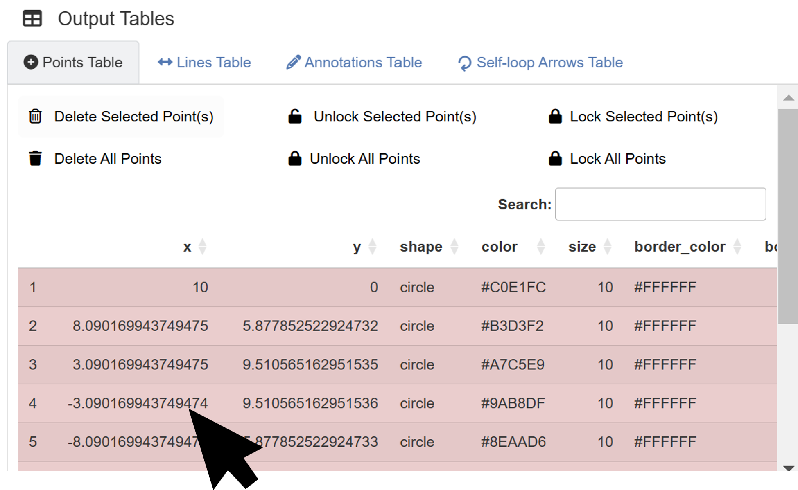
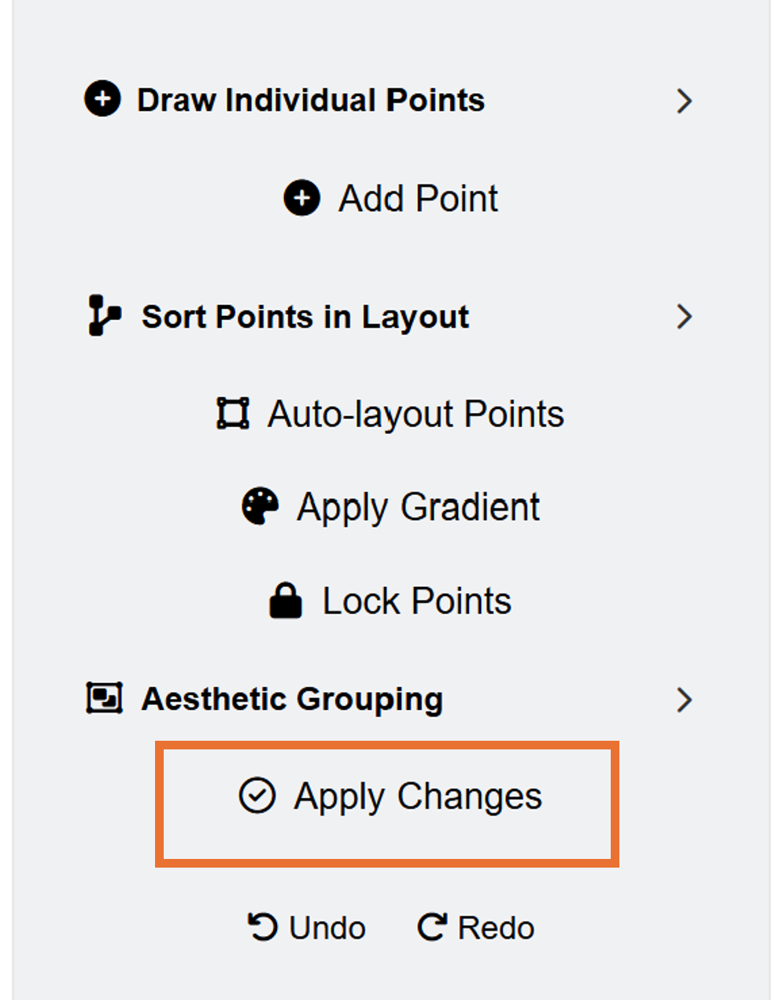
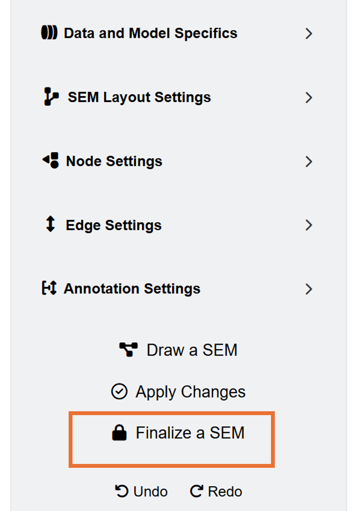
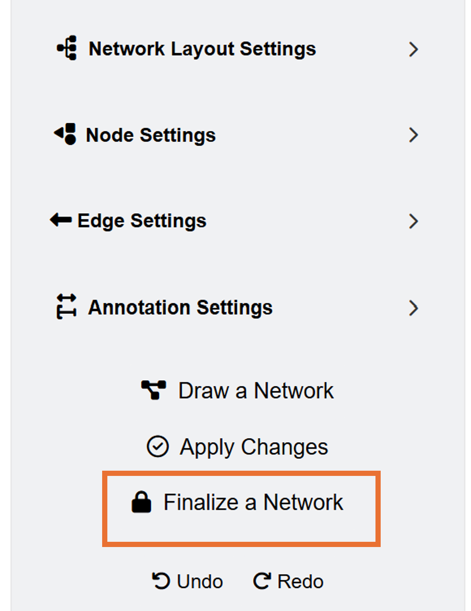

```{r, include = FALSE}
knitr::opts_chunk$set(
  collapse = TRUE,
  comment = "#>"
)
```

In this chapter, I will briefly discuss some features of **ggsem** that are worth pointing out.

## Output Tables Can Be Directly Edited

```{r,fig.align = 'center', echo=F, out.width = '90%'}

```

The output tables can be edited with a mouse click. If you want to change the X and Y coordinates using the output tables directly, click a specific row, and type in the input. Then, the app will re-render the final plot with modified coordinates of the element immediately.

For colors, only hex codes are allowed rather than color names. If you input an incorrect code, it will automatically default to having a black color.

Alpha values and gradient position can only range from 0 to 1. These columns won't accept character inputs. 

Do not worry if you make mistakes. The output tables will automatically default to certain settings instead if inappropriate inputs are provided. 

## Aesthetic Grouping Through Lock/Unlock

```{r,fig.align = 'center', echo=F, out.width = '35%'}

```


Lock/Unlock mechanisms are useful to modify multiple elements at once. These can be applied to all classes of elements: points, lines, annotations and self-loop arrows. 

Unlocked elements can be edited via the **Apply Changes** button.

You can manually select which elements to lock or unlock using the output tables. 

## Aesthetic Grouping of SEM Diagram

```{r,fig.align = 'center', echo=F, out.width = '35%'}

```

Elements generated from **SEM Data** are automatically grouped together through the *lavaan* column (set to `TRUE`). This means if you add another element separately (ex. circle point), the layout settings from **SEM Data** will not affect the separately generated element.

If you press the **Finalize a SEM** button, the inputs from the **SEM Data** menu will not affect the aesthetics of the SEM diagram because the app no longer recognizes as a SEM diagram (*lavaan* column set to `FALSE`).

Through this mechanism, you can generate multiple SEM diagrams in sequence. Generate a SEM diagram, modify its aesthetics, then **finalize** it. Then generate another SEM diagram, modify it, etc. 


## Aesthetic Grouping of Network Diagram

```{r,fig.align = 'center', echo=F, out.width = '35%'}

```

Elements generated from **Network Data** are also automatically grouped through the *network* column (set to `TRUE`). If you press the **Finalize a Network** button, the inputs from the **Network Data** menu will not affect the aesthetics of the network diagram because the app no longer recognizes as a network diagram (*network* column set to `FALSE`).

Through this mechanism, you can create several network diagrams in sequence. Generate a network diagram, modify its aesthetics, then **finalize** it. Then generate another network diagram, modify it, etc. 

