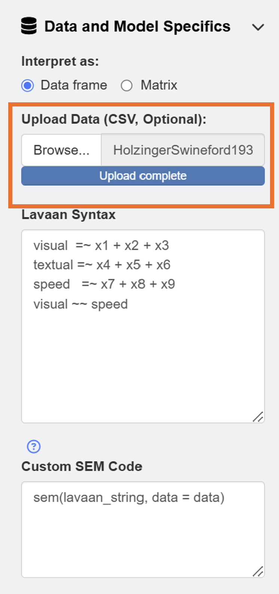
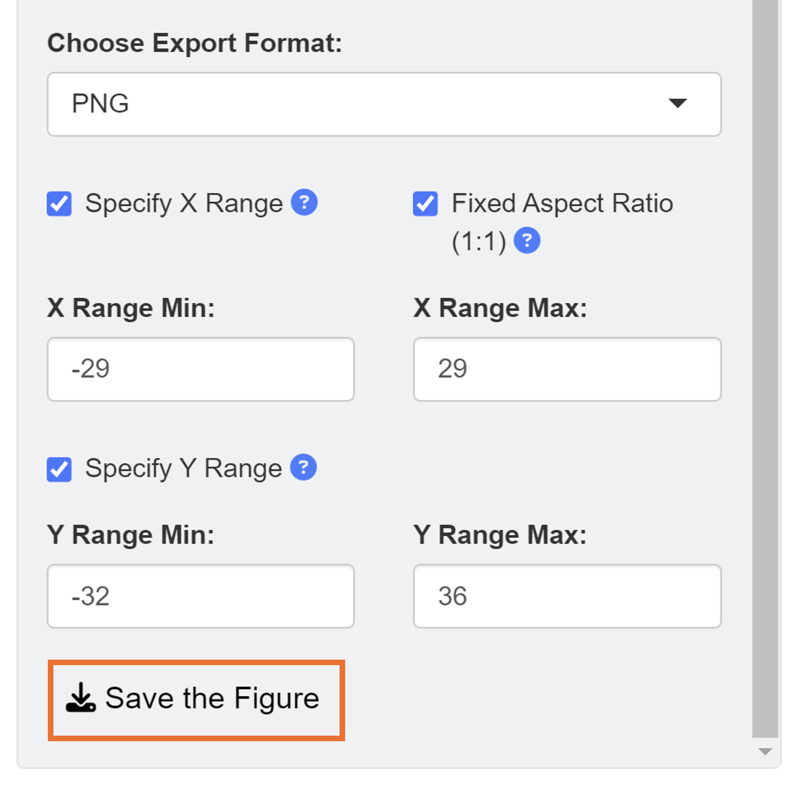

```{r, include = FALSE}
knitr::opts_chunk$set(
  collapse = TRUE,
  comment = "#>"
)
```

In this chapter, we will visualize path diagrams from structural equation modeling (SEM) with data files. 

## Data Formats

The *ggsem* web application accepts two types of CSV files for plotting SEM diagrams: **data frame** and **matrix**. The examples are shown here.

Basically, the data files should be able to understood by the **lavaan** package. Let's load data from the *lavaan* package.

```{r, message=F, warning=F}
library(tidyverse)
library(ggsem)
library(lavaan) # install.packages('lavaan')

head(PoliticalDemocracy)
```

The first example of data frame `PoliticalDemocracy` has a first column with id, where it identifies each row. This is a common feature for datasets to be analyzed in **lavaan**.

```{r, message=F, warning=F}
head(HolzingerSwineford1939)
```

The second example of data frame `HolzingerSwineford1939` also has a first column with id, where it identifies each row. Other column names refer to each variable (observed or latent).

If you plan to use your custom data files, please make sure they have similar structures as those in these two examples. 

You can download the datasets into your directory using these codes:

```{r}
df1 <- read.csv('https://www.smin95.com/HolzingerSwineford1939.csv', check.names = FALSE)
write_csv(df1, 'HolzingerSwineford1939.csv')

df2 <- read.csv('https://www.smin95.com/PoliticalDemocracy.csv', check.names = FALSE)
write_csv(df2, 'PoliticalDemocracy.csv')
```

Another format of data frame that **ggsem** recognizes is matrix, as shown below. This is directly from the example in **lavaan**'s documentation website (https://lavaan.ugent.be/tutorial/cov.html).

```{r, message=F, warning=F}
lower <- '
 11.834
  6.947   9.364
  6.819   5.091  12.532
  4.783   5.028   7.495   9.986
 -3.839  -3.889  -3.841  -3.625  9.610
-21.899 -18.831 -21.748 -18.775 35.522 450.288 '

wheaton.cov <- 
  getCov(lower, names = c("anomia67", "powerless67", 
                          "anomia71", "powerless71",
                          "education", "sei"))

wheaton.cov
```

There are few things that are noticeable from the matrix. The first element (row 1, column 1) is empty. The first column has names for variables. The column names match the names of the rows. The matrix has a symmetrical structure. This structure of matrix is recognized by the **lavaan** package, which **ggsem** uses to perform statistical analyses. Make sure to upload CSV file with this matrix structure in **ggsem**.

```{r, message=F, warning=F}
matrix_example <- as.matrix(read.csv('https://www.smin95.com/wheaton_cov.csv',
                                     row.names = 1, check.names = FALSE))
matrix_example
```

## ggsem Application

Let's open the application and visualize a SEM diagram with the data.

```{r, eval = FALSE}
ggsem()
```

First, readers should download data from https://www.smin95.com/HolzingerSwineford1939.csv and load it on the app in the **Data and Model Specifics** menu of **SEM Data**. We check box for **Data frame** so that our data  file is interpreted correctly.

```{r,fig.align = 'left', echo=F, out.width = '40%', fig.align='center'}

```

After loading the data, users can draw a SEM by clicking the **Draw a SEM** button.

```{r,fig.align = 'left', echo=F, out.width = '100%', fig.align='center'}

```

The default color of the latent nodes is red, that of the observed nodes is blue, and the that of the node label is white. However, these can be modified using input menu in **Node Settings** and **Edge Settings**. Apply aesthetic changes to the existing SEM diagram using the **Apply Changes** button.


```{r,fig.align = 'left', echo=F, out.width = '100%'}

```

Unlike in Chapter 3, where we drew a SEM diagram without data, we have drawn a SEM diagram with data, allowing the **ggsem** to perform statistical analyses. Hence, the SEM diagram has edge labels with parameter estimate values computed from the *lavaan* package. Those with statistical significance (p < 0.05) are labelled with asterisks (\*). These graphical outputs can be accessed in the *Annotations* table below the plotting space. The rows representing the edge labels have white color rather than red because these are **unlocked**. 

Notice that the default model syntax actually agrees with the data frame in this example. So, if you decide to use your own data, make sure to change the lavaan model. If you decide to use matrix as data file, make sure to change your **Custom SEM Code** as:

```{r, eval = FALSE}
sem(lavaan_string, sample.cov = data, sample.nobs = ..., ...)
```

In the **ggsem** app, `lavaan_string` stores your syntax input, `data` object stores the data you have uploaded. So, if these two things get changed in **Custom SEM Code**, error will occur. While these things should remain unchanged, other arguments can be added for specific analyses, such as `sample.cov` and `sample.nobs` to fit the model (`lavaan_string`) with a covariance matrix data.

Their unlocked status (from their *locked* column) allows users to group them aesthetically and modify their X and Y positions at once. To do it, go to **Text Annotation** menu. Make sure **Shift XY Only** is checked in the **Aesthetics Grouping** sub-menu.

```{r,fig.align = 'left', echo=F, out.width = '100%'}

```

In this example, we will shift the position of X and Y by a unit of 1. After inputing these values, click the **Apply Changes** button.

It is important to remember that **Apply Changes** button changes aesthetics of elements whose **lavaan** column is set to `TRUE`. So, other elements drawn separately (from individual points to network diagrams) will not be influenced.

```{r,fig.align = 'left', echo=F, out.width = '100%'}

```

Next, we will perform another modification using aesthetic grouping. We will enlarge the edge labels slightly. Under **Draw Individual Annotations** menu, input **Text Size** as 16. For **Aesthetic Grouping**, check **Aesthetics Only** to change aesthetics of unlocked annotations in group.

Finally, we add text annotation *SEM Data* at X = -2, Y = 32 with text size = 23 and fontface = bold by clicking the **Add Annotation** button in the **Text Annotations** menu.

When saving as a *png* file, users can select the x range and y range of the figure to remove surrounding white space. We set the range of X axis from -29 to 29 and Y axis from -32 to 36.

```{r,fig.align = 'left', echo=F, out.width = '40%', fig.align='center'}

```

This is the final png image after removing unnecessary white space from the *ggsem* application without any coding.

```{r,fig.align = 'left', echo=F, out.width = '100%'}

```

This can be produced with codes using the function `adjust_axis_range()` as shown below. In fact, the **ggsem** app uses this function to save figure outputs. 

```{r, eval = F}
# Don't run. Not a real code.
plot <- csv_to_ggplot(...)
plot_adjusted <- adjust_axis_range(plot, 
                                  x_range = c(-29, 29), 
                                  y_range = c(-32, 36))

save_figure("fig6g.png", plot_adjusted) # same as the app
```
